# OS 作业1

[TOC]

## 1.1 汇编“段”的概念

 一个C程序可以编译成目标文件或可执行文件。目标文件和可执行文件通常包含text、data、bss、rodata段，程序执行时也会用到堆（heap）和栈（stack）。

（1）请写一个C程序，使其**包含data段和bss段**，并在运行时包含**堆**的使用。请说明所写程序中哪些变量在data段、bss段和堆上。

（2）请了解readelf、objdump命令的使用，用这些命令查看（1）中所写程序的data和bss段，截图展示。

（3）请说明（1）中所写程序是否用到了栈。

提交内容：所写C程序、问题解答、截图等。

 ### （1）不同类变量在内存中的位置

本题考查各段内存储的内容：

- data段：存储已经初始化的全局变量
- bss段：存储未初始化的全局变量，其默认初始值为0
- 堆：动态分配的内存（一般在C程序中通过使用系统库函数进行动态分配）
- 代码段：存储代码

本题使用的测试代码如下：

```c
#include <stdlib.h>
#include <stdio.h>

int data1 = 2;  //存储在data段
int data2;      //存储在bss段
int main(){
    int *arr;
    arr =(int*)malloc(sizeof(int)*5);   //存储在堆
    printf("The addr of data1:%p\n", &data1);
    printf("The addr of data2:%p\n", &data2);
    printf("The addr of arr:%p\n", arr);

}
```

- data1是已经初始化的全局变量，其存储在data段；
- data2是未初始化的全局变量，其存储在bss段；
- arr数组占用的空间是动态分配的内存。存储在堆。

代码运行结果


### （2）查看汇编信息的基本指令

> 本部分结合了查找的资料，在自己的代码上测试；
>
> 测试文件：使用`gcc -S`, `as`得到的`.o`文件、`gcc`得到的可执行文件。

**readelf命令，**一般用于查看ELF格式的文件信息，常见的文件如在Linux上的可执行文件，动态库(*.so*)或者静态库(*.a*) 等包含ELF格式的文件。

- 选项 -h(elf header)，显示elf文件开始的文件头信息

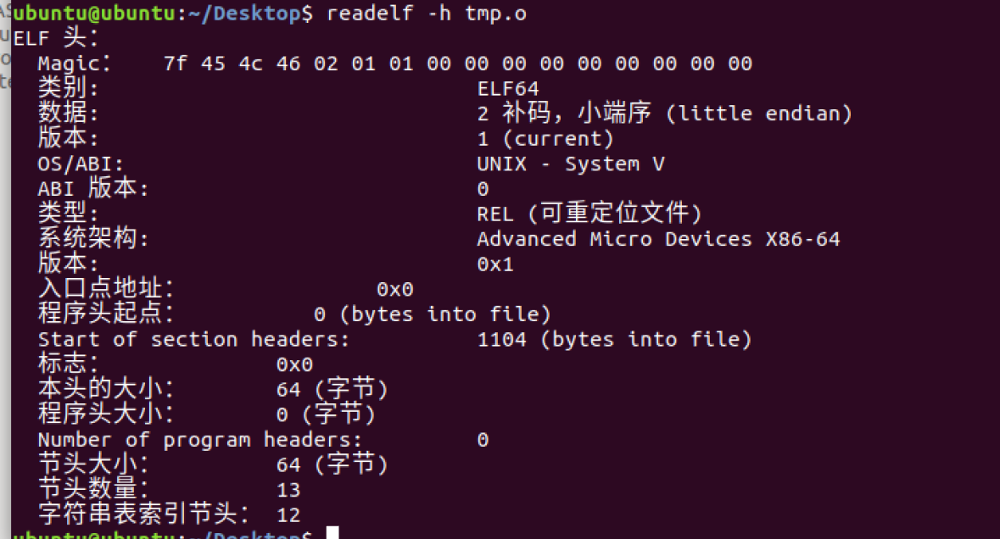

- 选项 -l(program headers)，segments 显示程序头（段头）信息(如果有数据的话)

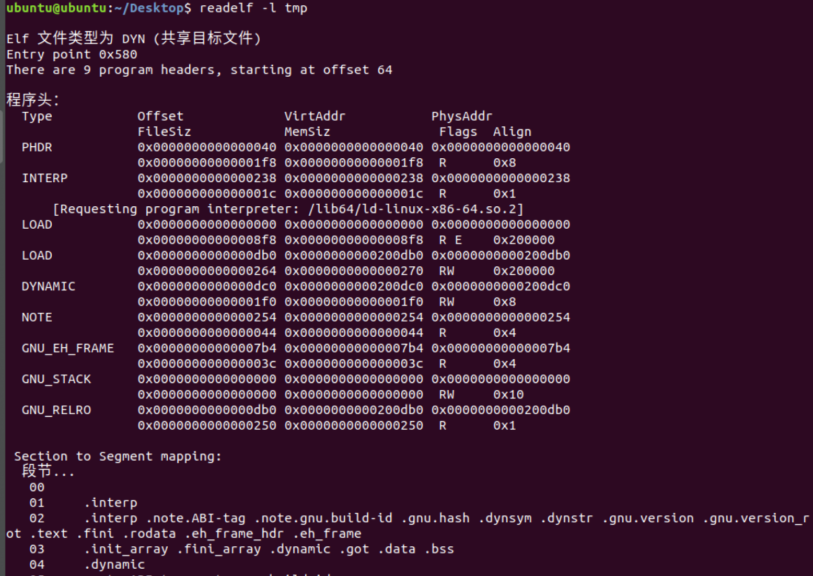

> 在测试中发现`.o`文件不包含程序头，查询得知：
>
> 对于可重定位文件（.o文件）并非必须的，因为其只需要包含基础代码和数据，无需指定代码与数据的绝对地址。
>
> 而程序头用于定义可执行文件在载入内存后的段内存布局，而对`.o`文件需要经过链接（ld）才可定义出具体的内存布局等。

- 更多选项可通过`man help`查看

**objdump**命令，以可阅读格式打印二进制文件的附加信息。

- 使用-h查看各段header信息

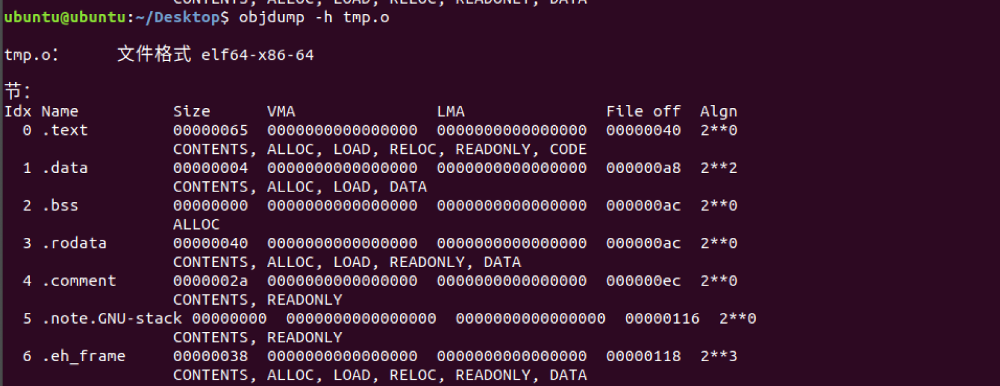

从中可见.data段分配了4 byte（一个int类型的数据data1占32bit），**.bss段未被分配内存**（默认为0，只在程序运行时分配空间，**存储时不占用内存**），.rodata段保存只读数据和字符串常量，含printf内字符串的内容；（动态分配的内存段）占用40 byte（一个含5个元素的int类型数组）

- 使用-s以十六进制将各段打印

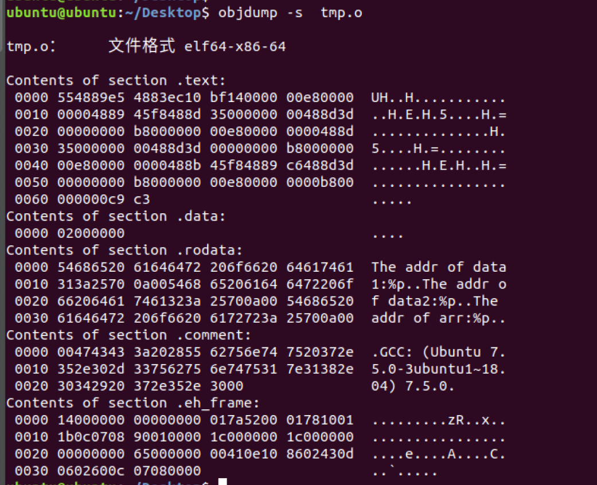

### （3）栈的概念

（1）中虽未显式地定义栈，但由于其调用了main函数，该过程中会为之分配栈帧，故会使用栈。

 ## 1.2 Linux 系统调用

Linux 下常见的3种系统调用方法包括有：

（1）通过glibc提供的库函数

（2）使用syscall函数直接调用相应的系统调用

（3）通过int 80指令（32位系统）或者syscall指令（64位系统）的内联汇编调用

请研究Linux(kernel>=2.6.24) getpid这一系统调用的用法，使用上述3种系统调用方法来执行，并记录和对比3种方法的运行时间，并尝试解释时间差异结果。

提示：gettimeofday和clock_gettime是Linux下用来测量耗时的常用函数，请调研这两个函数，选择合适函数来测量一次系统调用的时间开销。

提交内容：所写程序、执行结果、结果分析、系统环境（uname -a)等。

 ### （1）背景知识

#### 1. `getpid`

getpid用于返回当前进程的进程ID。

#### 2. `clock_gettime` VS `gettimeofday`

- clock_gettime 相比 gettimeofday的精度更高一些，前者精度到纳秒，而后者精度到微秒。

- clock_gettime可以通过时钟选项而得到不同参考下的时间，而gettimeofday则只有一种用途（获取当前系统时间）。

综合上述，决定采用clock_gettime作为计时函数。

#### 3.三种系统调用的具体实现

- 库函数：getpid对应库函数的声明为：`pid_t getpid(void)`，头文件`unistd.h`。

  > 查看`sys/types.h`的定义可知pid_t是short类型：
  >
  > ```c
  > typedef short           pid_t;       /* used for process ids */
  > ```

- syscall：内核提供给用户空间程序与内核空间进行交互的一套标准接口，通过`syscall(中断号)`进行系统调用。在 `unistd.h`文件记录着系统调用中断号的信息。

- 内联汇编：在相应寄存器中按序存入参数后（其中eax存放系统调用号），使用`int 0x80`进行系统调用。其中获取pid的系统调用号可以在 `/usr/include/asm/unistd.h`内查找到：

  ```c
  #define __NR_nanosleep 35
  #define __NR_getitimer 36
  #define __NR_alarm 37
  #define __NR_setitimer 38
  #define __NR_getpid 39
  #define __NR_sendfile 40
  #define __NR_socket 41
  
  ```

  可见getpid的系统调用号是39。

  

#### 4. 系统版本号

起初没仔细读题给信息，下意识就写了32位的汇编（之前汇编课主要使用的是32位汇编），对应内联汇编代码如下（32位汇编getpid的系统调用号是20）：

```assembly
 // 将tmp指定为寄存器eax（系统调用返回值放在eax寄存器内）
 asm("movl %%eax, 20\n\t"
     "int 0x80\n\t"
     : "=a"(tmp)
 );  
```

编译器报错如下：

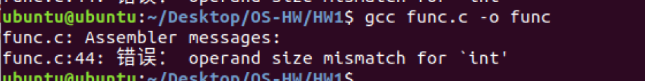

此时才想起来查看系统版本号：

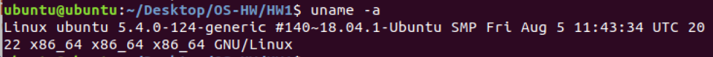

应写64位汇编。


### （2）测试代码

```c
#include <unistd.h>
#include <time.h>
#include <stdio.h>
#include <sys/types.h>
#include <sys/syscall.h>

/**
 *  @author 林孟颖
 *  @brief  使用-m [mode]来指定模式，
 *  @param mode  1：使用库函数；2：使用syscall；其它：使用内联汇编
 * */
int main(int argc,char **argv)
{
    pid_t tmp=0;
    int i;
    double time;
    struct timespec time1 = {0, 0}; 
    struct timespec time2 = {0, 0};
    int mode =3;
    if(argc<=2){
        printf("Default: use assembly...\n");
    }
    else{
        mode = (*argv[2])-'0';
    }
    if(mode==1){
        printf("Testing with library functions...\n");
        clock_gettime(CLOCK_REALTIME, &time1); 
        for(i=0;i<1000000;i++){
            tmp = getpid();
        }
        clock_gettime(CLOCK_REALTIME, &time2); 
    }
    else if(mode==2){
        printf("Testing with syscall...\n");
        clock_gettime(CLOCK_REALTIME, &time1); 
        for(i=0;i<1000000;i++){
            tmp = syscall (SYS_gettid);
        }
        clock_gettime(CLOCK_REALTIME, &time2); 
    }
    else{
        printf("Testing with inline assembly...\n");
        clock_gettime(CLOCK_REALTIME, &time1); 
        for(i=0;i<1000000;i++){
            // 将tmp指定为寄存器eax（系统调用返回值放在eax寄存器内）
            asm("movl $0x27,%%eax\n\t"
                    "syscall\n\t"
                    : "=a"(tmp)
                    );  
        }
        clock_gettime(CLOCK_REALTIME, &time2); 
    }
    time = (time2.tv_nsec - time1.tv_nsec)/10000000;
    printf("Pid: %d\n",tmp);
    printf("Use %f ms in total\n", time);
    return 0;
}
```

几点说明：

- 为避免用户“不配合”（啥也不输入or乱输入）导致段错误，设置默认模式为内联汇编测试；

- 为避免不知咋的没读出pid，将tmp初始化为0，避免后续printf访问未初始化变量；

- 为什么不将clock_gettime()提出，包裹if代码块减少代码冗余？

  条件判断过程中可能还涉及分支跳转和取消已预取指令的情况，而且条件判断是有一定顺序的，可能带来额外时延，虽然其相对于执行了10000000次的读取进程号而言可能微乎其微，但严谨起见还是将之置于分支内部。

  

### （3）测试结果

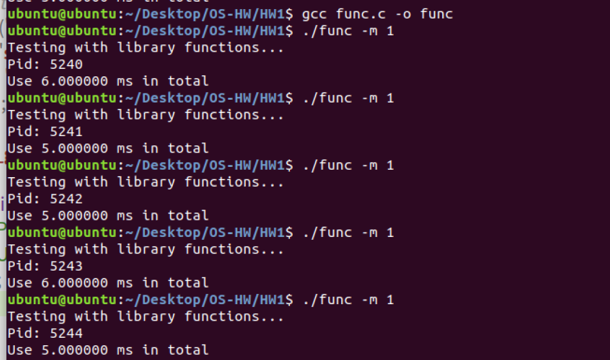

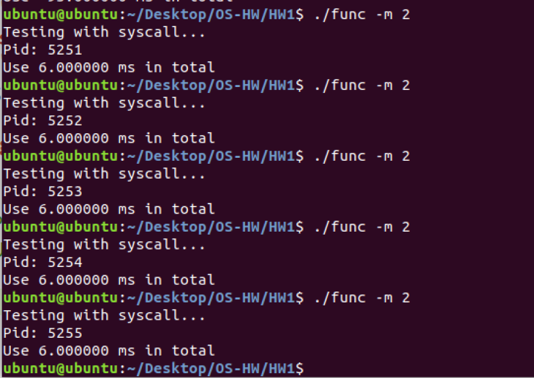

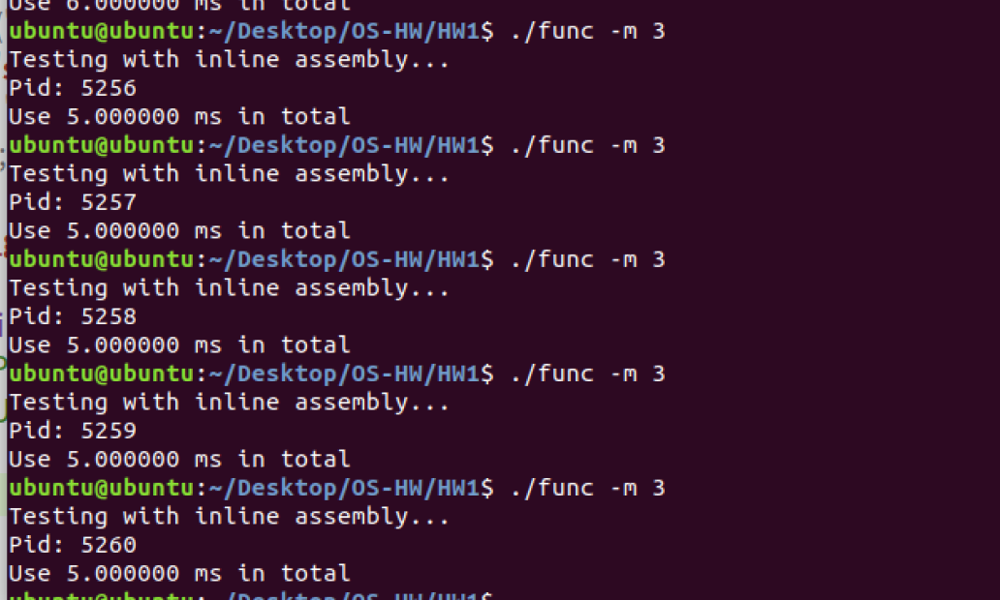

好像大差不差呀……这个时候只能通过反汇编代码马后炮分析了，将objdump -d的输出重定向到.S文件内，查看三种实现方式的反汇编代码（定位方法：夹在两个clock_gettime内的代码即对应反汇编代码）：

使用库函数的反汇编：

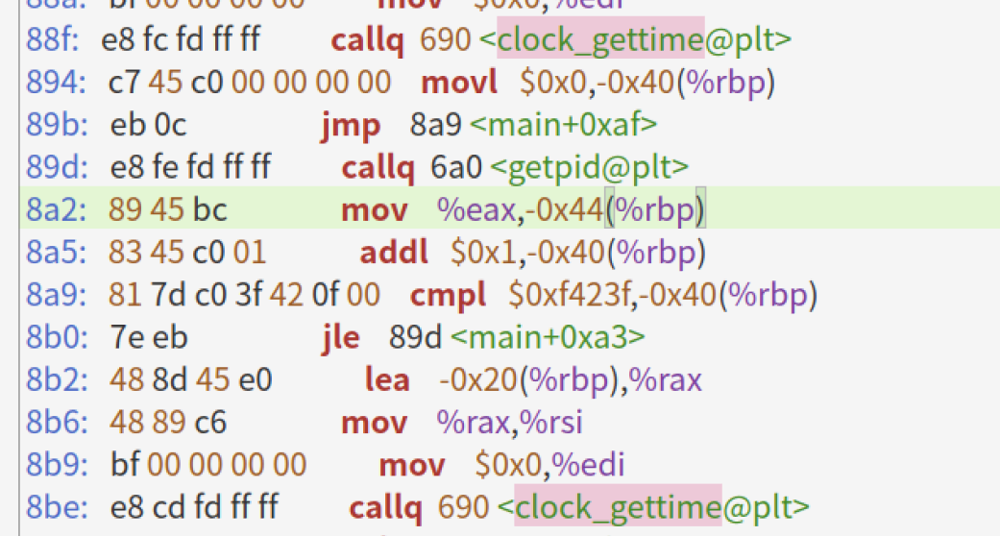

使用syscall的反汇编：

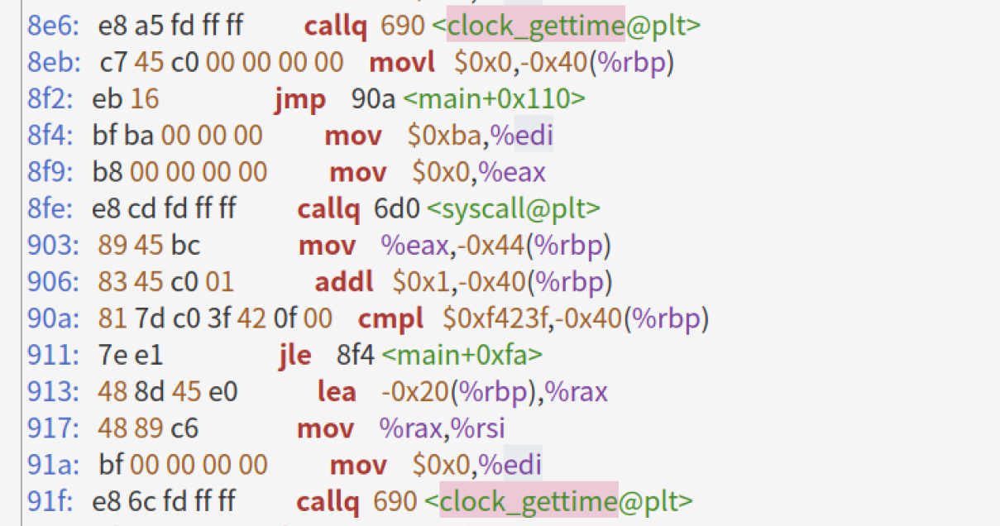

内联汇编：

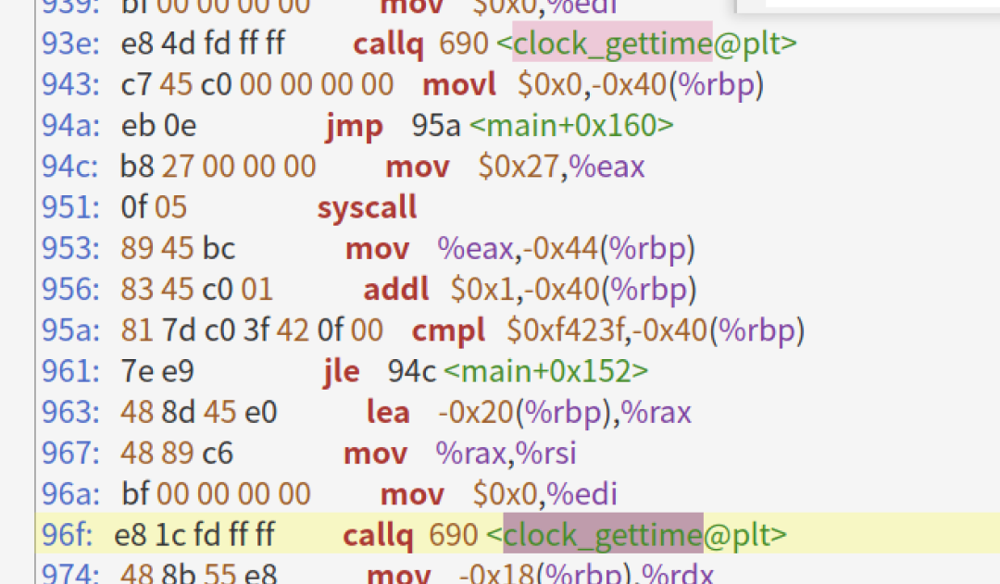

从中可见，除却循环判断操作的细微差异之外，库函数实现和syscall实现的反汇编代码一致，而我写的内联汇编看上去简单一点，纯属是因为我没考虑到系统调用前应该要保存eax寄存器的值……

## 1.2 的后续

之后和同学交流后得知，即使未显式地使用O2优化，编译器也可能自动做出相应优化，故应该显示地声明-O0；

同时上述多次循环测试的方法包含了分支判断和跳转指令（十分费时），其很可能占据了测试耗时的大头，故更为合理的方法是多次测试单次操作，定性地分析。

### （1）测试代码

修改代码如下：

```c
#include <unistd.h>
#include <time.h>
#include <stdio.h>
#include <sys/types.h>
#include <sys/syscall.h>

/**
 *  @author 林孟颖
 *  @brief  使用-m [mode]来指定模式，
 *  @param mode  1：使用库函数；2：使用syscall；其它：使用内联汇编
 * */
int main(int argc,char **argv)
{
    pid_t tmp=0;
    int i;
    double time;
    struct timespec time1 = {0, 0}; 
    struct timespec time2 = {0, 0};
    int mode =3;
    if(argc<=2){
        printf("Default: use assembly...\n");
    }
    else{
        mode = (*argv[2])-'0';
    }
    if(mode==1){
        printf("Testing with library functions...\n");
        clock_gettime(CLOCK_REALTIME, &time1); 
        tmp = getpid();
        clock_gettime(CLOCK_REALTIME, &time2); 
    }
    else if(mode==2){
        printf("Testing with syscall...\n");
        clock_gettime(CLOCK_REALTIME, &time1); 
            tmp = syscall (SYS_gettid);
        clock_gettime(CLOCK_REALTIME, &time2); 
    }
    else{
        printf("Testing with inline assembly...\n");
        clock_gettime(CLOCK_REALTIME, &time1); 
        // 将tmp指定为寄存器eax（系统调用返回值放在eax寄存器内）
        asm("movl $0x27,%%eax\n\t"
                "syscall\n\t"
                : "=a"(tmp)
                );  
        clock_gettime(CLOCK_REALTIME, &time2); 
    }
    time = (time2.tv_nsec - time1.tv_nsec)/10;
    printf("Pid: %d\n",tmp);
    printf("Use %f ns in total\n", time);
    return 0;
}
```

### （2）测试结果

耗时：系统函数>系统调用>自编汇编代码

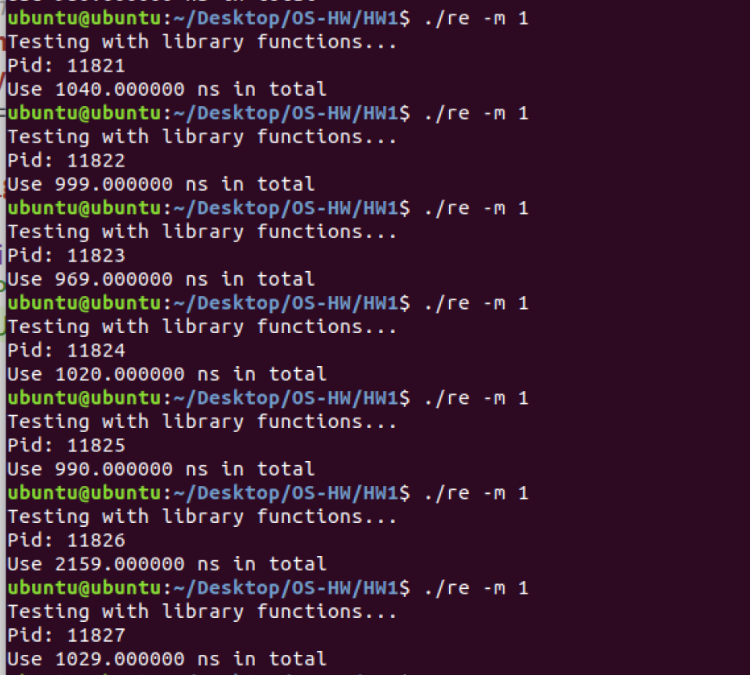


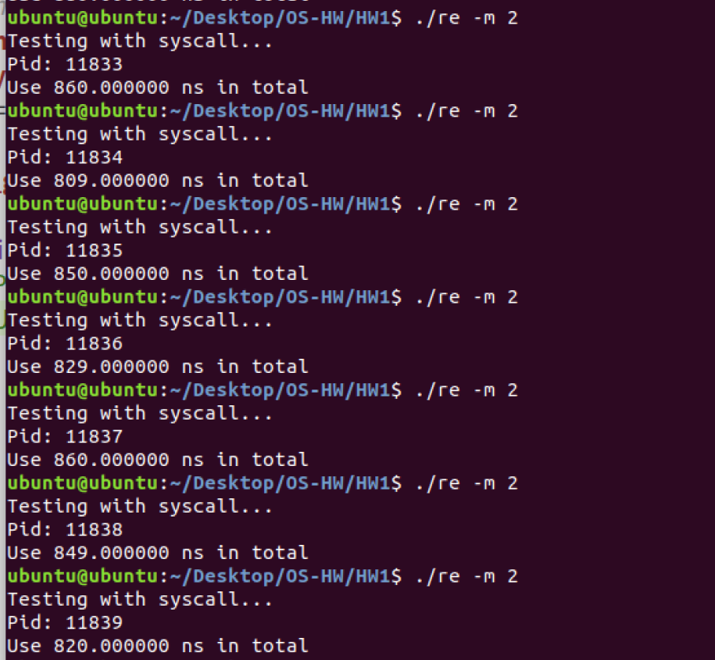


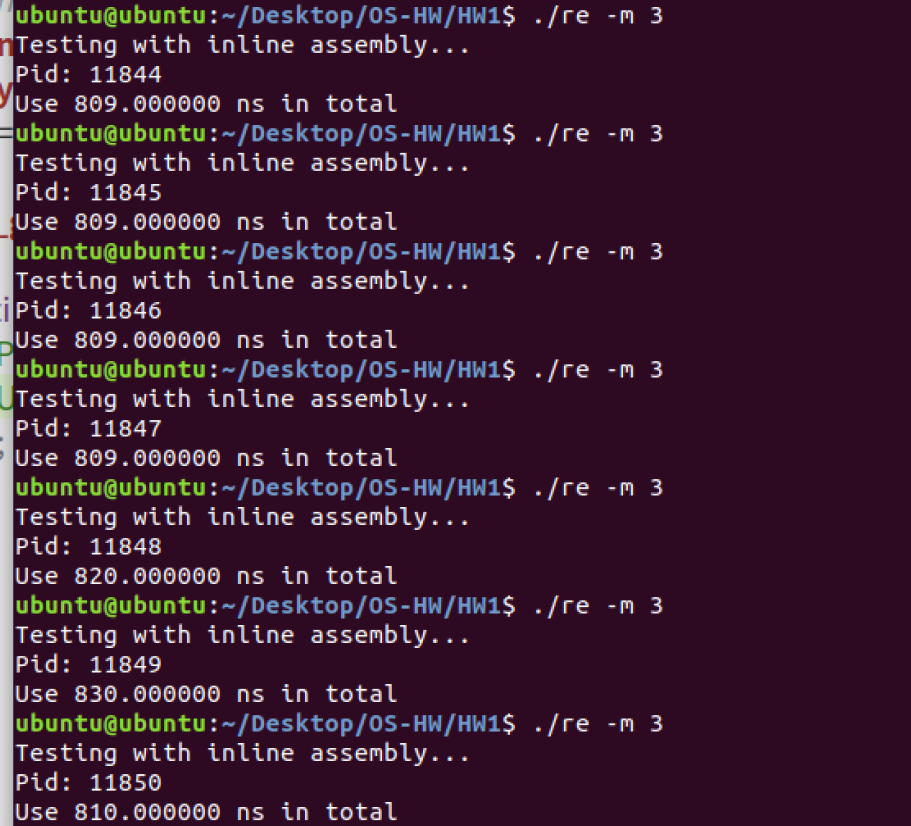

### （3）原因分析

先查看三者的反汇编代码：

```assembly
 # 系统库函数
 88f:	e8 fc fd ff ff       	callq  690 <clock_gettime@plt>
 894:	e8 07 fe ff ff       	callq  6a0 <getpid@plt>
 899:	89 45 c0             	mov    %eax,-0x40(%rbp)
 89c:	48 8d 45 e0          	lea    -0x20(%rbp),%rax
 8a0:	48 89 c6             	mov    %rax,%rsi
 8a3:	bf 00 00 00 00       	mov    $0x0,%edi
 8a8:	e8 e3 fd ff ff       	callq  690 <clock_gettime@plt>
 
 # 系统调用
 8d0:	e8 bb fd ff ff       	callq  690 <clock_gettime@plt>
 8d5:	bf ba 00 00 00       	mov    $0xba,%edi
 8da:	b8 00 00 00 00       	mov    $0x0,%eax
 8df:	e8 ec fd ff ff       	callq  6d0 <syscall@plt>
 8e4:	89 45 c0             	mov    %eax,-0x40(%rbp)
 8e7:	48 8d 45 e0          	lea    -0x20(%rbp),%rax
 8eb:	48 89 c6             	mov    %rax,%rsi
 8ee:	bf 00 00 00 00       	mov    $0x0,%edi
 8f3:	e8 98 fd ff ff       	callq  690 <clock_gettime@plt>
 
 # 内联汇编
 912:	e8 79 fd ff ff       	callq  690 <clock_gettime@plt>
 917:	b8 27 00 00 00       	mov    $0x27,%eax
 91c:	0f 05                	syscall 
 91e:	89 45 c0             	mov    %eax,-0x40(%rbp)
 921:	48 8d 45 e0          	lea    -0x20(%rbp),%rax
 925:	48 89 c6             	mov    %rax,%rsi
 928:	bf 00 00 00 00       	mov    $0x0,%edi
 92d:	e8 5e fd ff ff       	callq  690 <clock_gettime@plt>
```

系统库函数慢于系统调用的原因是：getpid函数的实现本就依赖于系统调用，调用库函数后还会进一步进行系统调用，以获取进程号；

系统调用略慢于内联汇编的原因是：其实现步骤中多了一步mov操作，但整体差异不明显。
