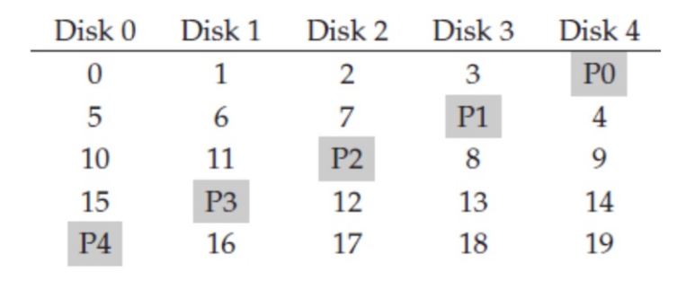

# OS作业4

    林孟颖 2020K8009915008

#### 11.1 

现有一块磁盘，扇区大小为512B，假设其平均寻道时间是5ms，旋转速率是15000 RPM（每分钟15000转），传输带宽是200MB/s，请计算：

1）当程序分别读取256B，1KB，4KB，1MB的数据时，这四种情况下的有效带宽各是多少？

2）如果希望软件读写该磁盘的有效带宽达到180MB/s，则软件的读写粒度应为多大？

---

1）寻道平均时间皆是5ms，平均旋转耗时（按半圈记）$\frac{0.5}{15000} \times 60,000ms = 2ms$，有效带宽公式：
$$
BW=\frac{传输的数据量}{寻道时间+旋转延迟+数据传输时间}
$$

- 传输256B：传输时间$\frac{256B}{200MB/s} \approx 2.4 \times 10^{-3}ms$，有效带宽：36.57 B/ms
- 传输1KB：传输时间$\frac{1KB}{200MB/s} \approx 9.76 \times 10^{-3}ms$，有效带宽：146.29 B/ms

- 传输4KB：传输时间$\frac{4KB}{200MB/s} \approx 3.91 \times 10^{-2}ms$，有效带宽：581.82 B/ms
- 传输1MB：传输时间$\frac{1MB}{200MB/s} \approx 5 ms$，有效带宽：83MB/s

2）设读写粒度为x MB：
$$
\frac{x\times1000}{(2+5+x/200\times1000)} = 180
$$
解得：x=12.6MB

#### 11.2 

现有一块磁盘，假设其磁头当前位于第106磁道，正在向磁道序号增加的方向移动。现有一个磁盘访问请求序列，其访问的磁道号依次为33，55，10，68，110，180，170，205，请计算：

1）当分别采用FIFO、SSF和C-SCAN三种磁盘调度算法执行上述磁盘请求序列时，三种情况下的寻道距离各是多少？

- FIFO：
  - 移动顺序：106-33-55-10-68-110-180-170-205
  - 寻道距离：73+22+45+58+42+70+10+35 = 355
- SSF：
  - 移动顺序：106-110-68-55-33-10-170-180-205
  - 寻道距离： 4+42+13+22+23+160+10+25 = 299
- C-SCAN：
  - 移动顺序：106-110-170-180-205 ---折回---0-10-33-55-68
  - 寻道距离： 4+60+10+25+205+10+23+22+13 = 372

 

#### 11.3 

现有一个由5块磁盘组成的磁盘阵列，采用RAID-5模式，如下图所示。该磁盘阵列每块盘的磁盘块（block）大小为4KB，每条（strip）含一个块；磁盘的平均寻道时间是4ms，旋转速度是7200 RPM（每分钟7200转），传输带宽是200MB/s，请计算：

1）平均来说，从该RAID5阵列上读出一个条带（stripe）的时间是多少？

2）当向该RAID5阵列中**写入**连续的两个4KB数据块时，平均来说，所需的时间是多少？请考虑这两个数据块属于同一个条带和不同条带的两种情况。

---

1）旋转延迟时间：0.5/7200 x 60,000 ms = 4ms

传输时间：$4KB / 200MB/s = 10/2^9 ms \approx 0.02ms$，总耗时：（4+4+0.02）ms = 8.02ms

2）

- 当两个数据块属于同一个条带：修改之前需要先读出原本存储值与原本校验值，二者可并行，传输时间0.04ms，只需进行一次寻道&旋转定位，旋转延迟时间：4ms，寻道时间4ms，写入耗时0.04ms，共需8.08ms；
- 当两个数据块不属于同一个条带，需要考虑是否存在读取数据冲突现象：
  - 读取有冲突（如两个块分别位于strip 3、4，strip 3对应的校验信息P0和strip 4读取有冲突）：需要进行两次寻道&旋转定位，同时写入也不可并行，共计 0.04 x 2 + (4+4) x2 + 0.04 x 2 = 16.16ms
  - 读取无冲突，情况与两个数据块属于同一个条带时相同，共需8.08ms
