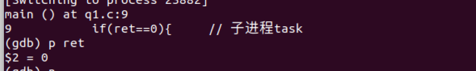

# OS 作业2

[TOC]

## 1.1 熟悉fork、exec、wait API

fork、exec、wait等是进程操作的常用API，请调研了解这些API的使用方法。

（1）请写一个C程序，该程序首先创建一个1到10的整数数组，然后创建一个子进程，并让子进程对前述数组所有元素求和，并打印求和结果。等子进程完成求和后，父进程打印“parent process finishes”,再退出。

（2）在（1）所写的程序基础上，当子进程完成数组求和后，让其执行ls -l命令(注：该命令用于显示某个目录下文件和子目录的详细信息)，显示你运行程序所用操作系统的某个目录详情。例如，让子进程执行 ls -l /usr/bin目录，显示/usr/bin目录下的详情。父进程仍然需要等待子进程执行完后打印“parent process finishes”,再退出。

（3）请阅读XV6代码（https://pdos.csail.mit.edu/6.828/2021/xv6.html），找出XV6代码中对进程控制块（PCB）的定义代码，说明其所在的文件，以及当fork执行时，对PCB做了哪些操作？

提交内容

（1） 所写C程序，打印结果截图，说明等

（2） 所写C程序，打印结果截图，说明等

（3） 代码分析介绍

 ### （1）数组求和

#### 1. 背景知识

##### fork()

- 头文件`unistd.h`

- 原型：`pid_t fork(void)`

- 功能：fork()将父进程复制一份子进程，在子进程中从fork()调用处继续执行，之后的代码在父子进程中各自执行一遍；

- 返回值：类型为`pid_t`。最终父进程的fork()返回子进程的pid，子进程的fork()返回0表示创建成功.。

  > 通过返回值不同区分父子进程

- 子父进程关系：只读的情况下**代码段、数据段、堆栈的物理地址皆同，但虚拟地址不同**；**子or父进程有写某个段的行为时，会为子进程分配新的物理空间**（写时分配）。

##### wait()

- 头文件`sys/wait.h`

- 原型：`int wait(int *status)`

- 功能：让一个进程等待另一个进程，最常见的是父进程等待自己的子进程，或者父进程回收自己的子进程资源（如僵尸进程）

  > [僵尸进程介绍](https://blog.csdn.net/lyndon_li/article/details/114297211?ops_request_misc=%7B%22request%5Fid%22%3A%22166256295516782414977025%22%2C%22scm%22%3A%2220140713.130102334..%22%7D&request_id=166256295516782414977025&biz_id=0&utm_medium=distribute.pc_search_result.none-task-blog-2~all~top_click~default-2-114297211-null-null.142^v47^new_blog_pos_by_title,201^v3^control_2&utm_term=僵尸进程&spm=1018.2226.3001.4187)

#### 2. 程序代码与运行结果

```c
#include <stdio.h>
#include <sys/wait.h>
#include <unistd.h>
int main(){
    int data[]={1, 2, 3, 4, 5, 6, 7, 8, 9, 10};
    int sum=0;
    pid_t ret=fork();
    // 父进程fork返回子进程的pid
    if(ret==0){     // 子进程task
        for(int i=0; i<10; i++)
            sum+=data[i];
        printf("Result in subprocess is %d\n", sum);
    }
    // 子进程fork返回0
    else if(ret>0){  // 父进程的task
        wait(&ret); // 等待子进程结束
        printf("parent process finishes\n");
    }
    // 进程创建失败
    else
        printf("Fail to create a new progress.\n");
    return 0;
}
```

程序运行结果如下：


#### 3.运行过程分析

使用gdb跟踪程序运行过程：

先使用`set follow-fork-mode child`跟踪子进程：


查看此时fork返回值，为0，说明目前处于子进程：



设置断点在循环结束处，求和结果为55：


使用`set follow-fork-mode parent`跟踪父进程：


查看此时fork返回值，为子进程pid：23916。其在等待子进程结束后（已输出求和结果），打印父进程结束信息：


### （2）查看汇编信息的基本指令

#### 1. 背景知识：EXEC

- 头文件：`unist.h`

- 功能：一函数族，用于在进程中启动另一个程序执行

- 函数族原型：

  ```c
  int execl(const char *path, const char *arg, ...);
  int execlp(const char *file, const char *arg, ...);
  int execle(const char *path, const char *arg, ..., char *const 
  envp[]);
  int execv(const char *path, char *const argv[]);
  int execvp(const char *file, char *const argv[]);
  int execve(const char *
  ```

> 说明：各函数功能类似，只是接受的参数不同。本次作业中采用`execv`
>
> - 功能：用来执行参数path字符串所指向的程序，第二个为数组指针维护的程序参数列表，该数组的**最后一个成员必须是空指针**。

#### 2. 程序代码与运行结果

```c
#include <stdio.h>
#include <sys/wait.h>
#include <unistd.h>
int main(){
    int data[]={1, 2, 3, 4, 5, 6, 7, 8, 9, 10};
    int sum=0;
    pid_t ret=fork();
    // 父进程fork返回子进程的pid
    if(ret==0){     // 子进程task
        for(int i=0; i<10; i++)
            sum+=data[i];
        printf("Result in subprocess is %d\n", sum);
        // execv：首个参数给出程序的path，第二个参数是字符串数组（即命令行），以空指针结尾
        char *cmd[] = {"ls", "-l", "/usr/bin", NULL};  
        execv("/bin/ls", cmd);
    }
    // 子进程fork返回0
    else if(ret>0){  // 父进程的task
        wait(&ret); // 等待子进程结束
        printf("parent process finishes\n");
    }
    // 进程创建失败
    else
        printf("Fail to create a new progress.\n");
    return 0;
}
```

运行结果：


#### 3. 运行过程分析

断点打在execv指令处，并监视子进程：


单步跟踪可知其在该处通过系统调用执行了一个新的程序`/bin/ls`：


### （3）xv6 源码分析

#### 1. PCB定义

在`proc.h`中可查看进程PCB的定义：

```c
// Per-process state
struct proc {
  uint sz;                     // Size of process memory (bytes)
  pde_t* pgdir;                // Page table
  char *kstack;                // Bottom of kernel stack for this process
  enum procstate state;        // Process state
  int pid;                     // Process ID
  struct proc *parent;         // Parent process
  struct trapframe *tf;        // Trap frame for current syscall
  struct context *context;     // swtch() here to run process
  void *chan;                  // If non-zero, sleeping on chan
  int killed;                  // If non-zero, have been killed
  struct file *ofile[NOFILE];  // Open files
  struct inode *cwd;           // Current directory
  char name[16];               // Process name (debugging)
};
```

由上述，每个PCB块中包含的信息有：

进程的内存大小、页表、该进程对应的栈底指针、进程的状态（UNUSED, EMBRYO, SLEEPING, RUNNABLE, RUNNING, ZOMBIE）、进程号、父进程、栈帧信息、进程的上下文（即相关寄存器的值，含edi、esi、ebx、ebp、eip）、进程打开的文件、进程当前路径以及进程名称。

#### 2. fork操作分析

在`proc.c`中可查看fork的实现：

```c
// Create a new process copying p as the parent.
// Sets up stack to return as if from system call.
// Caller must set state of returned proc to RUNNABLE.
int
fork(void)
{
  int i, pid;
  struct proc *np;
  struct proc *curproc = myproc();

  // Allocate process.
  if((np = allocproc()) == 0){
    return -1;
  }

  // Copy process state from proc.
  if((np->pgdir = copyuvm(curproc->pgdir, curproc->sz)) == 0){
    kfree(np->kstack);
    np->kstack = 0;
    np->state = UNUSED;
    return -1;
  }
  np->sz = curproc->sz;
  np->parent = curproc;
  *np->tf = *curproc->tf;

  // Clear %eax so that fork returns 0 in the child.
  np->tf->eax = 0;

  for(i = 0; i < NOFILE; i++)
    if(curproc->ofile[i])
      np->ofile[i] = filedup(curproc->ofile[i]);
  np->cwd = idup(curproc->cwd);

  safestrcpy(np->name, curproc->name, sizeof(curproc->name));

  pid = np->pid;

  acquire(&ptable.lock);

  np->state = RUNNABLE;

  release(&ptable.lock);

  return pid;
}
```

fork对PCB的操作流程如下：

- 使用`allocproc`创建一个新的进程控制块

- 从父进程中复制当前路径以及内存大小），并将其parent域指向其父进程

  > 倘若复制不成功则将该进程置为`UNUSED`并返回-1

- 将子进程的eax寄存器清零（确保其返回值为0，以标识其为子进程）

- 使用`filedup`逐个打开当前父进程使用的文件，并使用`idup`释放icache的锁，将父进程cwd中的引用计数器加一（ref++）后赋值给子进程的cwd（因子进程与父进程共用文件列表信息，故其引用计数应加一）

  > 可在fs.c中查看idup函数的定义，返回值inode，是unix中的一种数据结构 ，用作索引结点，存放档案基本信息（如时间、使用者等）
  
- 使用`safestrcpy`将父进程的名称深度拷贝给子进程

- 将子进程的状态置为`RUNNABLE`，返回子进程的PID

  > 关于其返回pid的确定可查看`proc.c`中的`allocproc`函数，其涉及到查找进程表。

 ## 1.2 创建多个子进程

请阅读以下程序代码，回答下列问题

（1）该程序一共会生成几个子进程？请你画出生成的进程之间的关系（即谁是父进程谁是子进程），并对进程关系进行适当说明。

（2）如果生成的子进程数量和宏定义LOOP不符，在不改变for循环的前提下，你能用少量代码修改，使该程序生成LOOP个子进程么？

```c
#include<unistd.h>
#include<stdio.h>
#include<string.h>
#define LOOP 2

int main(int argc,char *argv[])
{
   pid_t pid;
   int loop;

   for(loop=0;loop<LOOP;loop++) {

      if((pid=fork()) < 0)
         fprintf(stderr, "fork failed\n");
      else if(pid == 0) {
         printf(" I am child process\n");
      }
      else {
         sleep(5);
      }
    }
    return 0;
}


```

提交内容

（1） 问题解答，关系图和说明等

（2） 修改后的代码，结果截图，对代码的说明等

 ### （1）进程嵌套

该程序会生成三个子进程，各个进程间的关系如下：


- parent调用folk产生子进程1，此后进入休眠，执行子进程1，子进程1有和parent一样的代码段和数据段，此时子进程1中loop=0，打印出“I am child process”后执行到loop递增的步骤，子进程1中loop=1；
- 子进程1调用folk产生子进程1-1，此后进入休眠，执行子进程1-1，子进程1-1中loop=1，打印出“I am child process”后loop递增，loop=2，退出创建新进程的循环，回到其父进程（子进程1）；
- 子进程1的loop递增，loop=2，退出循环，回到其父进程（parent）；
- parent休眠后loop递增等于1，继续folk出子进程2，子进程2中loop=1，打印出“I am child process”后递增，loop=2，退出循环回到父进程（parent）；
- parent的loop递增等于2，退出循环，程序结束。

上述流程的执行顺序可由以下代码验证：

```c
#include<unistd.h>
#include<stdio.h>
#include<string.h>
#define LOOP 2

int main(int argc,char *argv[])
{
   pid_t pid;
   int loop;

   for(loop=0;loop<LOOP;loop++) {

      if((pid=fork()) < 0)
         fprintf(stderr, "fork failed\n");
      else if(pid == 0) {
         printf(" I am child process, my pid is: %d, my parent pid is: %d\n", getpid(), getppid());
        //  printf(" I am child process\n");
      }
      else {
         printf("I am parent, my pid is %d\n", getpid());
         sleep(2);
      }
    }
    return 0;
}


```

运行结果如下：


### （2）生成LOOP个子进程

思路：此时需要避免子进程再调用folk产生新的子进程，只需要在进入子进程后直接退出创建进程的循环即可。

```c
#include<unistd.h>
#include<stdio.h>
#include<string.h>
#define LOOP 2

int main(int argc,char *argv[])
{
   pid_t pid;
   int loop;

   for(loop=0;loop<LOOP;loop++) {

      if((pid=fork()) < 0)
         fprintf(stderr, "fork failed\n");
      else if(pid == 0) {
         printf(" I am child process\n");
         break;
      }
      else {
         sleep(5);
      }
    }
    return 0;
}


```

同样再修改代码使得其打印出进程号相关的信息：

```c
#include<unistd.h>
#include<stdio.h>
#include<string.h>
#define LOOP 2

int main(int argc,char *argv[])
{
   pid_t pid;
   int loop;

   for(loop=0;loop<LOOP;loop++) {

      if((pid=fork()) < 0)
         fprintf(stderr, "fork failed\n");
      else if(pid == 0) {
         printf(" I am child process, my pid is: %d, my parent pid is: %d\n", getpid(), getppid());
         break;
      }
      else {
         printf("I am parent, my pid is %d\n", getpid());
         sleep(2);
      }
    }
    return 0;
}


```

可见父进程皆是25526，即子进程未再folk出新的子进程：


