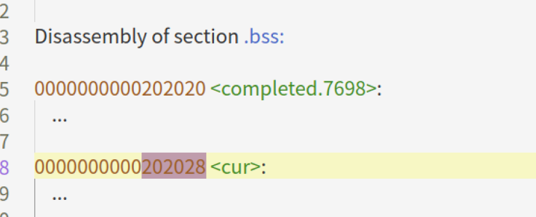

# OS 作业3

[TOC]

## 3.1 熟悉pthread库

pthread函数库可以用来在Linux上创建线程，请调研了解pthread_create，pthread_join，pthread_exit等API的使用方法，然后完成以下任务：

（1）写一个C程序，首先创建一个值为1到100万的整数数组，然后对这100万个数求和。请打印最终结果，统计求和操作的耗时并打印。（注：可以使用作业1中用到的gettimeofday和clock_gettime函数测量耗时）；

（2）在（1）所写程序基础上，在创建完1到100万的整数数组后，使用pthread函数库创建N个线程（N可以自行决定, 且N>1），由这N个线程完成100万个数的求和，并打印最终结果。请统计N个线程完成求和所消耗的总时间并打印。和（1）的耗费时间相比，你能否解释（2）的耗时结果？（注意：可以多运行几次看测量结果）

（3）在（2）所写程序基础上，增加绑核操作，将所创建线程和某个CPU核绑定后运行，并打印最终结果，以及统计N个线程完成求和所消耗的总时间并打印。和（1）、（2）的耗费时间相比，你能否解释（3）的耗时结果？（注意：可以多运行几次看测量结果）

> 提示： cpu_set_t类型，CPU_ZERO、CPU_SET宏，以及sched_setaffinity函数可以用来进行绑核操作，它们的定义在sched.h文件中。请调研了解上述绑核操作。以下是一个参考示例。

假设你的电脑有两个核core 0和core1,同时你创建了两个线程thread1和thread2，则可以用以下代码在线程执行的函数中进行绑核操作。

示例代码：

```c
//需要引入的头文件和宏定义
#define __USE_GNU  
#include <sched.h>
#include <pthread.h>

//线程执行的函数
void *worker(void *arg){
cpu_set_t cpuset;   //CPU核的位图
   CPU_ZERO(&cpuset);  //将位图清零
   CPU_SET(N, &cpuset);  //设置位图第N位为1，表示与core N绑定。N从0开始计数
   sched_setaffinity(0, sizeof(cpuset), &cpuset);  //将当前线程和cpuset位图中指定的核绑定运行

   //其他操作
}
```

提交内容：

（1） 所写C程序，打印结果截图等

（2） 所写C程序，打印结果截图，分析说明等

（3） 所写C程序，打印结果截图，分析说明等

### （0）背景知识

#### 1. `pthread_create`

- 头文件：`pthread.h`

- 函数原型：

  ```c
  int pthread_create(pthread_t *thread,
                     const pthread_attr_t *attr,
                     void *(*start_routine) (void *),
                     void *arg);
  ```

- 参数含义：

  - `pthread_t *thread`：传递一个 pthread_t 类型的指针变量，也可以直接传递某个 pthread_t 类型变量的地址。

    > pthread_t 是一种用于表示线程的数据类型，每一个 pthread_t 类型的变量都可以表示一个线程。 

  - `const pthread_attr_t *attr`：用于手动设置新建线程的属性，例如线程的调用策略、线程所能使用的栈内存的大小等。

    > **通常attr 参数赋值为 NULL**，pthread_create() 函数会采用系统默认的属性值创建线程。

  -  `void *(start_routine) (void *)`：以函数指针的方式指明新建线程需要执行的函数，该函数的参数最多有 1 个（可以省略不写），**形参和返回值的类型都必须为 void* 类型**。
  - `void *arg`：指定传递给 start_routine 函数的实参，当不需要传递任何数据时，将 arg 赋值为 NULL 即可。

- 返回值：如果成功创建线程，pthread_create() 函数返回数字 0，反之返回非零值。

#### 2. `pthread_join`

- 头文件：`pthread.h`

- 函数原型：

  ```c
  int pthread_join(pthread_t thread, void ** retval);
  ```

- 参数含义：

  - `pthread_t thread`：用于指定接收哪个线程的返回值； 

  - `void **retval`：表示接收到的返回值。

    > 如果 thread 线程没有返回值，又或者我们不需要接收 thread 线程的返回值，可以将 retval 参数置为 NULL。

- 功能：pthread_join() 函数会一直阻塞调用它的线程，直至目标线程执行结束（接收到目标线程的返回值），阻塞状态才会解除。

- 返回值：成功等到了目标线程执行结束（成功获取到目标线程的返回值），返回值为数字 0；否则返回其余非零值。

#### 3. `pthread_exit`

- 头文件：`pthread.h`

- 函数原型：

  ```c
  void pthread_exit(void *retval);int pthread_join(pthread_t thread, void ** retval);
  ```

- 参数含义：

  - `void *retval`：指向的数据将作为线程退出时的返回值。如果线程不需要返回任何数据，将 retval 参数置为 NULL 即可。

    > Note：retval 指针**不能指向函数内部的局部变量**！！函数返回后其所属内存已被释放，访问可能导致程序crash！

- 功能：pthread_join() 函数会一直阻塞调用它的线程，直至目标线程执行结束（接收到目标线程的返回值），阻塞状态才会解除。

- 返回值：成功等到了目标线程执行结束（成功获取到目标线程的返回值），返回值为数字 0；否则返回其余非零值。

### （1）单线程求和

程序代码如下：

```c
//需要引入的头文件和宏定义
#define __USE_GNU  
#include <sched.h>
#include <pthread.h>
#include <sys/time.h>
#include  <stdio.h>
#define MAX 1000000

int main(){
    //创建数组
    int data[MAX], i;
    long long sum=0;
    struct timeval begin, end;
    for(i=0;i<MAX;i++)
        data[i] = i+1;
    
    //求和并计算时间
    gettimeofday(&begin, NULL);
    for(i=0; i<MAX; i++)
        sum+=data[i];
    gettimeofday(&end, NULL);
    printf("The result is: %lld\n", sum);
    printf("Use %ld us in total\n", (end.tv_usec - begin.tv_usec));
}
```

运行结果如下：


### （2）无绑核操作的多线程求和

程序代码如下：

```c
//需要引入的头文件和宏定义
#define __USE_GNU  
#include <sched.h>
#include <pthread.h>
#include <sys/time.h>
#include  <stdio.h>
#define MAX 1000000
#define N 2
int data[MAX], cur=0;
long long sum=0;


//线程执行的函数
void *worker(void *arg){
    // cpu_set_t cpuset;   //CPU核的位图
    // CPU_ZERO(&cpuset);  //将位图清零
    // CPU_SET(N, &cpuset);  //设置位图第N位为1，表示与core N绑定。N从0开始计数
    // sched_setaffinity(0, sizeof(cpuset), &cpuset);  //将当前线程和cpuset位图中指定的核绑定运行
    while(cur<MAX)    
        sum+=data[cur++];
    pthread_exit(NULL);
}

int main(){
    pthread_t child[N];
    struct timeval begin, end;
    int i;
    int state[N];
    //创建数组
    for(i=0;i<MAX;i++)
        data[i] = i+1;
    // 创建N个线程，求和并计算时间
    gettimeofday(&begin, NULL);
    for(i=0; i<N; i++)
        pthread_create(&child[i], NULL, &worker, &i);
    //等待所有线程结束
    for(i=0; i<N; i++)
        state[i]=pthread_join(child[i], NULL);
    gettimeofday(&end, NULL);
    for(i=0; i<N; i++){
        if(state[i]){
            printf("Fail to wait thread %d to finish.\n", i);
            return -1;
        }
    }
    printf("The result is: %lld\n", sum);
    printf("Use %ld us in total\n", (end.tv_usec - begin.tv_usec));
}
```


先测试开辟五个线程，运行结果如下：


开辟两个线程：


注意到此时多线程的耗时反而远大于单线程求和，同时求和结果不等于预期值。gdb添加对cur变量的监视：


从黄色线中可以看出不同线程在不断切换，从蓝色线可以看出每次cur变量的增量不严格等于1。原因如下：不同线程交替访问全局变量可能导致数据冲突，如线程1和线程2恰都执行到递增步骤，就有可能跳过对某项数据的求和，导致求和结果偏小。冲突访问和线程的不断切换也导致耗时长于单线程。

### （3）含绑核操作的多线程求和

#### 1. 代码优化过程

##### CPU为单核的情况

第一版程序代码如下：

```c
//需要引入的头文件和宏定义
#include  <stdio.h>
#define __USE_GNU  
#include <sched.h>
#include <pthread.h>
#include <sys/time.h>
#define MAX 1000000
#define N 5
int data[MAX], cur=0, i;
long long sum=0;


//线程执行的函数
void *worker(void *arg){
    cpu_set_t cpuset;   //CPU核的位图
    CPU_ZERO(&cpuset);  //将位图清零
    CPU_SET(*(int*)arg, &cpuset);  //设置位图第N位为1，表示与core N绑定。N从0开始计数
    sched_setaffinity(0, sizeof(cpuset), &cpuset);  //将当前线程和cpuset位图中指定的核绑定运行
    while(cur<MAX)    
        sum+=data[cur++];
    pthread_exit(NULL);
}

int main(){
    pthread_t child[N];
    struct timeval begin, end;
    int state[N];
    //创建数组
    for(i=0;i<MAX;i++)
        data[i] = i+1;
	// 创建N个线程，求和并计算时间
    gettimeofday(&begin, NULL);
    for(i=0; i<N; i++)
        pthread_create(&child[i], NULL, &worker, &i);
    //等待所有线程结束
    for(i=0; i<N; i++)
        state[i]=pthread_join(child[i], NULL);
    gettimeofday(&end, NULL);
    for(i=0; i<N; i++){
        if(state[i]){
            printf("Fail to wait thread %d to finish.\n", i);
            return -1;
        }
    }
    printf("The result is: %lld\n", sum);
    printf("Use %ld us in total\n", (end.tv_usec - begin.tv_usec));
}
```


运行结果如下：


发现运行时间并未缩短，且求和的结果仍是小于预期，查看核数：


发现cpu核仅有一个，无法真正意义上做到给每个子线程分配单独的CPU。

##### CPU为多核的情况

重新分配虚拟机的CPU核数：


开辟两个线程结果如下：


开辟五个线程结果如下：


发现依旧是线程越多耗时越长，且速度甚至慢于只用单核的情况。尝试gdb跟踪，并在worker函数入口打断点：


发现传入参数的值（用于指定绑定的核）不从0开始递增，且每次递增的值不严格等于0，先测试一把，让每个进程打印其绑定的核：

```c
//需要引入的头文件和宏定义
#include  <stdio.h>
#define __USE_GNU  
#include <sched.h>
#include <pthread.h>
#include <sys/time.h>
#define MAX 1000000
#define N 5
int data[MAX], cur=0;
long long sum=0;


//线程执行的函数
void *worker(void *arg){
    int core_id = *(int*)arg;
    cpu_set_t cpuset;   //CPU核的位图
    CPU_ZERO(&cpuset);  //将位图清零
    CPU_SET(core_id, &cpuset);  //设置位图第N位为1，表示与core N绑定。N从0开始计数
    sched_setaffinity(0, sizeof(cpuset), &cpuset);  //将当前线程和cpuset位图中指定的核绑定运行
    printf("bound to core %d\n", core_id);
    while(cur<MAX)    
        sum+=data[cur++];
    pthread_exit(NULL);
}

int main(){
    pthread_t child[N];
    struct timeval begin, end;
    int state[N], i;
    //创建数组
    for(i=0;i<MAX;i++)
        data[i] = i+1;
    // 创建N个线程，求和并计算时间
    gettimeofday(&begin, NULL);
    for(i=0; i<N; i++)
        pthread_create(&child[i], NULL, &worker, &i);
    //等待所有线程结束
    for(i=0; i<N; i++)
        state[i]=pthread_join(child[i], NULL);
    gettimeofday(&end, NULL);
    for(i=0; i<N; i++){
        if(state[i]){
            printf("Fail to wait thread %d to finish.\n", i);
            return -1;
        }
    }
    printf("The result is: %lld\n", sum);
    printf("Use %ld us in total\n", (end.tv_usec - begin.tv_usec));
}
```

输出结果如下：


不知道为啥有的线程绑定了相同的核，猜测是因为不同线程在同时访问i的地址以获取其值，又导致了冲突，然后出现了一些难以解释的现象……修改代码如下，保证其绑定不同的核：

```c
//需要引入的头文件和宏定义
#include  <stdio.h>
#define __USE_GNU  
#include <sched.h>
#include <pthread.h>
#include <sys/time.h>
#define MAX 1000000
#define N 5
int data[MAX], cur=0;
long long sum=0;


//线程执行的函数
void *worker(void *arg){
    int core_id = *(int*)arg;
    cpu_set_t cpuset;   //CPU核的位图
    CPU_ZERO(&cpuset);  //将位图清零
    CPU_SET(core_id, &cpuset);  //设置位图第N位为1，表示与core N绑定。N从0开始计数
    sched_setaffinity(0, sizeof(cpuset), &cpuset);  //将当前线程和cpuset位图中指定的核绑定运行
    printf("bound to core %d\n", core_id);
    while(cur<MAX)    
        sum+=data[cur++];
    pthread_exit(NULL);
}

int main(){
    pthread_t child[N];
    struct timeval begin, end;
    int state[N], i;
    int core_id[]={0, 1, 2, 3, 4};
    //创建数组
    for(i=0;i<MAX;i++)
        data[i] = i+1;
    // 创建N个线程，求和并计算时间
    gettimeofday(&begin, NULL);
    for(i=0; i<N; i++)
        pthread_create(&child[i], NULL, &worker, &core_id[i]);
    //等待所有线程结束
    for(i=0; i<N; i++)
        state[i]=pthread_join(child[i], NULL);
    gettimeofday(&end, NULL);
    for(i=0; i<N; i++){
        if(state[i]){
            printf("Fail to wait thread %d to finish.\n", i);
            return -1;
        }
    }
    printf("The result is: %lld\n", sum);
    printf("Use %ld us in total\n", (end.tv_usec - begin.tv_usec));
}
```


#### 2. 最终代码

```c
//需要引入的头文件和宏定义
#include  <stdio.h>
#define __USE_GNU  
#include <sched.h>
#include <pthread.h>
#include <sys/time.h>
#define MAX 1000000
#define N 5
int data[MAX], cur=0;
long long sum=0;


//线程执行的函数
void *worker(void *arg){
    int core_id = *(int*)arg;
    cpu_set_t cpuset;   //CPU核的位图
    CPU_ZERO(&cpuset);  //将位图清零
    CPU_SET(core_id, &cpuset);  //设置位图第N位为1，表示与core N绑定。N从0开始计数
    sched_setaffinity(0, sizeof(cpuset), &cpuset);  //将当前线程和cpuset位图中指定的核绑定运行
    // printf("bound to core %d\n", core_id);
    while(cur<MAX)    
        sum+=data[cur++];
    pthread_exit(NULL);
}

int main(){
    pthread_t child[N];
    struct timeval begin, end;
    int state[N], i;
    int core_id[]={0, 1, 2, 3, 4};
    //创建数组
    for(i=0;i<MAX;i++)
        data[i] = i+1;
    // 创建N个线程，求和并计算时间
    gettimeofday(&begin, NULL);
    for(i=0; i<N; i++)
        pthread_create(&child[i], NULL, &worker, &core_id[i]);
    //等待所有线程结束
    for(i=0; i<N; i++)
        state[i]=pthread_join(child[i], NULL);
    gettimeofday(&end, NULL);
    for(i=0; i<N; i++){
        if(state[i]){
            printf("Fail to wait thread %d to finish.\n", i);
            return -1;
        }
    }
    printf("The result is: %lld\n", sum);
    printf("Use %ld us in total\n", (end.tv_usec - begin.tv_usec));
}
```

使用5核，输出结果如下：


#### 3. 汇编过程分析

查看worker的反汇编代码：

```assembly

000000000000088a <worker>:
 88a:	55                   	push   %rbp
 88b:	48 89 e5             	mov    %rsp,%rbp
 88e:	48 81 ec b0 00 00 00 	sub    $0xb0,%rsp
 895:	48 89 bd 58 ff ff ff 	mov    %rdi,-0xa8(%rbp)
 89c:	64 48 8b 04 25 28 00 	mov    %fs:0x28,%rax
 8a3:	00 00 
 8a5:	48 89 45 f8          	mov    %rax,-0x8(%rbp)
 8a9:	31 c0                	xor    %eax,%eax
 8ab:	48 8b 85 58 ff ff ff 	mov    -0xa8(%rbp),%rax
 8b2:	8b 00                	mov    (%rax),%eax
 8b4:	89 85 64 ff ff ff    	mov    %eax,-0x9c(%rbp)
 8ba:	48 8d 85 70 ff ff ff 	lea    -0x90(%rbp),%rax
 8c1:	48 89 c6             	mov    %rax,%rsi
 8c4:	b8 00 00 00 00       	mov    $0x0,%eax
 8c9:	ba 10 00 00 00       	mov    $0x10,%edx
 8ce:	48 89 f7             	mov    %rsi,%rdi
 8d1:	48 89 d1             	mov    %rdx,%rcx
 8d4:	f3 48 ab             	rep stos %rax,%es:(%rdi)
 8d7:	8b 85 64 ff ff ff    	mov    -0x9c(%rbp),%eax
 8dd:	48 98                	cltq   
 8df:	48 89 85 68 ff ff ff 	mov    %rax,-0x98(%rbp)
 8e6:	48 81 bd 68 ff ff ff 	cmpq   $0x3ff,-0x98(%rbp)
 8ed:	ff 03 00 00 
 8f1:	77 4d                	ja     940 <worker+0xb6>
 8f3:	48 8b 85 68 ff ff ff 	mov    -0x98(%rbp),%rax
 8fa:	48 c1 e8 06          	shr    $0x6,%rax
 8fe:	48 8d 14 c5 00 00 00 	lea    0x0(,%rax,8),%rdx
 905:	00 
 906:	48 8d 8d 70 ff ff ff 	lea    -0x90(%rbp),%rcx
 90d:	48 01 ca             	add    %rcx,%rdx
 910:	48 8b 12             	mov    (%rdx),%rdx
 913:	48 8b 8d 68 ff ff ff 	mov    -0x98(%rbp),%rcx
 91a:	83 e1 3f             	and    $0x3f,%ecx
 91d:	be 01 00 00 00       	mov    $0x1,%esi
 922:	48 d3 e6             	shl    %cl,%rsi
 925:	48 89 f1             	mov    %rsi,%rcx
 928:	48 8d 34 c5 00 00 00 	lea    0x0(,%rax,8),%rsi
 92f:	00 
 930:	48 8d 85 70 ff ff ff 	lea    -0x90(%rbp),%rax
 937:	48 01 f0             	add    %rsi,%rax
 93a:	48 09 ca             	or     %rcx,%rdx
 93d:	48 89 10             	mov    %rdx,(%rax)
 940:	48 8d 85 70 ff ff ff 	lea    -0x90(%rbp),%rax
 947:	48 89 c2             	mov    %rax,%rdx
 94a:	be 80 00 00 00       	mov    $0x80,%esi
 94f:	bf 00 00 00 00       	mov    $0x0,%edi
 954:	e8 e7 fd ff ff       	callq  740 <sched_setaffinity@plt>
 959:	eb 37                	jmp    992 <worker+0x108>
 95b:	8b 05 c7 16 20 00    	mov    0x2016c7(%rip),%eax        # 202028 <cur>
 961:	8d 50 01             	lea    0x1(%rax),%edx
 964:	89 15 be 16 20 00    	mov    %edx,0x2016be(%rip)        # 202028 <cur>
 96a:	48 98                	cltq   
 96c:	48 8d 14 85 00 00 00 	lea    0x0(,%rax,4),%rdx
 973:	00 
 974:	48 8d 05 c5 16 20 00 	lea    0x2016c5(%rip),%rax        # 202040 <data>
 97b:	8b 04 02             	mov    (%rdx,%rax,1),%eax
 97e:	48 63 d0             	movslq %eax,%rdx
 981:	48 8b 05 a8 16 20 00 	mov    0x2016a8(%rip),%rax        # 202030 <sum>
 988:	48 01 d0             	add    %rdx,%rax
 98b:	48 89 05 9e 16 20 00 	mov    %rax,0x20169e(%rip)        # 202030 <sum>
 992:	8b 05 90 16 20 00    	mov    0x201690(%rip),%eax        # 202028 <cur>
 998:	3d 3f 42 0f 00       	cmp    $0xf423f,%eax
 99d:	7e bc                	jle    95b <worker+0xd1>
 99f:	bf 00 00 00 00       	mov    $0x0,%edi
 9a4:	e8 a7 fd ff ff       	callq  750 <pthread_exit@plt>
```

先观察其对cur的操作：

```assembly
 95b:	8b 05 c7 16 20 00    	mov    0x2016c7(%rip),%eax        # 202028 <cur>
 961:	8d 50 01             	lea    0x1(%rax),%edx
 964:	89 15 be 16 20 00    	mov    %edx,0x2016be(%rip)        # 202028 <cur>
 
 .....
 992:	8b 05 90 16 20 00    	mov    0x201690(%rip),%eax        # 202028 <cur>
 998:	3d 3f 42 0f 00       	cmp    $0xf423f,%eax
 99d:	7e bc                	jle    95b <worker+0xd1>
```

- 通过寄存器寻址的方式将cur的值从bss段中读出（虽然其已经被初始化，但由于其初值为0，编译器还是自动将之放于bss段）
  
- 将cur递增后再存于bss段
- 一次求和后再将cur的值从bss段中读出，并比较其值与循环结束值的大小。

其对sum求和也是如此，反复读出、加和、再写回bss段。

#### 4.结论

##### 多线程速度<单线程

由汇编代码可见一次加和操作被分为若干条指令，而在多线程运行的过程中，各个线程在高速切换的过程中可能互相打断，导致cur的值更新若干次才执行一次累加求和操作，导致计算出的值偏小。

##### 多核多线程线程速度<单核多线程线程

在此之前我一直认为核数越多越好。查找资料得知，多核的性能未必就优于单核。

对于python多线程编程：在单核CPU上，数百次的间隔检查才会导致一次线程切换；而在多核CPU上，存在严重的**线程颠簸**（thrashing），将导致多核多线程的效率反而低于单核多线程。

单核下多线程，每次释放GIL，唤醒的那个线程都能获取到GIL锁，所以能够无缝执行，但多核下，CPU0释放GIL后，其他CPU上的线程都会进行竞争，但GIL可能会马上又被CPU0拿到，导致其他几个CPU上被唤醒后的线程会醒着等待直到切换时间结束后又进入待调度状态，导致线程颠簸，降低了系统效率。

> [python下同样代码，多核多线程为什么比单核多线程慢很多？-Python教程-PHP中文网](https://www.php.cn/python-tutorials-88997.html#:~:text=自己研究了一下：多核多线程比单核多线程更差，原因是单核下多线程，每次释放GIL，唤醒的那个线程都能获取到GIL锁，所以能够无缝执行，但多核下，CPU0释放GIL后，其他CPU上的线程都会进行竞争，但GIL可能会马上又被CPU0拿到，导致其他几个CPU上被唤醒后的线程会醒着等待直到切换时间结束后又进入待调度状态，导致线程颠簸，降低了系统效率。. 不知道这样解释对不对。. 望有人能指正., 微信.  分享.)

也有人从cache的角度解释为何多核可能慢于单核：
若一块内存被多个 CPU 频繁使用，它就会出现在多个 CPU 的 L1 Cache 中。若其中某个 CPU 修改了这块内存，其他 CPU 中**相应的 L1 Cache 会更新或失效**以保持缓存一致性，故如果多个核频繁读写同一块内存，会比单核更慢。

>[linux下多进程和多线程的性能比较 (google.com)](https://groups.google.com/g/ustc_lug/c/H1A2hyF9Qtg?pli=1)

## 3.2 多线程数组赋值

请调研了解pthread_create，pthread_join，pthread_exit等API的使用方法后，完成以下任务：

（1）写一个C程序，首先创建一个有100万个元素的整数型空数组，然后使用pthread创建N个线程（N可以自行决定, 且N>1），由这N个线程完成前述100万个元素数组的赋值(注意:赋值时第i个元素的值为i) 。最后由主进程对该数组的100万个元素求和,并打印结果,验证线程已写入数据。

 

提交内容：

（1） 所写C程序，打印结果截图,关键代码注释等

 ### （1）初版思路

 #### 1. 代码

定义全局变量cur，作为当前应当赋值的数组元素的下标：

```c
//需要引入的头文件和宏定义
#define __USE_GNU  
#include <sched.h>
#include <pthread.h>
#include <sys/time.h>
#include  <stdio.h>
#define MAX 1000000
#define N 1
int data[MAX], cur=0;


//线程执行的函数
void *worker(void *arg){
    // cpu_set_t cpuset;   //CPU核的位图
    // CPU_ZERO(&cpuset);  //将位图清零
    // CPU_SET(N, &cpuset);  //设置位图第N位为1，表示与core N绑定。N从0开始计数
    // sched_setaffinity(0, sizeof(cpuset), &cpuset);  //将当前线程和cpuset位图中指定的核绑定运行
    while(cur<MAX){
        data[cur] = cur+1;
        cur++;
    }
    pthread_exit(NULL);
}

int main(){
    pthread_t child[N];
    struct timeval begin, end;
    int i;
    int state[N];
    long long sum=0;
    // 创建N个线程，并对数组赋值
    gettimeofday(&begin, NULL);
    for(i=0; i<N; i++)
        pthread_create(&child[i], NULL, &worker, &i);
    //等待所有线程结束
    for(i=0; i<N; i++)
        state[i]=pthread_join(child[i], NULL);
    gettimeofday(&end, NULL);
    for(i=0; i<N; i++){
        if(state[i]){   // 若失败返回值为0
            printf("Fail to wait thread %d to finish.\n", i);
            return -1;
        }
    }
    for(i=0;i<MAX;i++)
        sum+=data[i];
    // 打印当前线程数、计算结果、总用时
    printf("Thread nums: %d\n", N);
    printf("The result is: %lld\n", sum);
    printf("Use %ld us in total\n", (end.tv_usec - begin.tv_usec));
}
```


#### 2. 运行结果

- 测试1：N=2
  

- 测试2：N=5
  

- 测试3：N=1

  

由上可见只有单线程的情况可以避免冲突，且耗时较短，但为了完成题述中的任务，考虑给每一个线程分一个不同的任务，以实现赋值不冲突的效果。

### （2）数组局部赋值

各个线程需要赋值的部分不同，或许能有效避免冲突：

```c
//需要引入的头文件和宏定义
#define __USE_GNU  
#include <sched.h>
#include <pthread.h>
#include <sys/time.h>
#include  <stdio.h>
#define MAX 1000000
#define N 5
#define STRIDE  MAX/N
int data[MAX];
int   cur;

//线程执行的函数
void *worker(void *arg){
    int from, to;
    from = cur;
    to = from + STRIDE;
    while(from<to){
        data[from]= from+1;
        from++;
    }
    pthread_exit(NULL);
}

int main(){
    pthread_t child[N];
    struct timeval begin, end;
    int i;
    int state[N];
    long long sum=0;
    // 创建N个线程，并对数组赋值
    gettimeofday(&begin, NULL);
    for(i=0; i<N; i++){
        cur = i* STRIDE;
        pthread_create(&child[i], NULL, &worker, NULL);
    }
    //等待所有线程结束
    for(i=0; i<N; i++)
        state[i]=pthread_join(child[i], NULL);
    gettimeofday(&end, NULL);
    for(i=0; i<N; i++){
        if(state[i]){   // 若失败返回值为0
            printf("Fail to wait thread %d to finish.\n", i);
            return -1;
        }
    }
    for(i=0;i<MAX;i++)
        sum+=data[i];
    // 打印当前线程数、计算结果、总用时
    printf("Thread nums: %d%d\n", N);
    printf("The result is: %lld\n", sum);
    printf("Use %ld us in total\n", (end.tv_usec - begin.tv_usec));
}
```

但输出结果依旧很吊诡：


打印相关结果帮助debug：


#### 1. 最终代码

发现部分线程分配到的活仍是一样的，这与绑核操作时遇到的问题一致，仿照其解决方法，先将其起始赋值地址存于数组，并以arg传给线程：

```c
//需要引入的头文件和宏定义
#define __USE_GNU  
#include <sched.h>
#include <pthread.h>
#include <sys/time.h>
#include  <stdio.h>
#define MAX 1000000
#define N 5
#define STRIDE  MAX/N
int data[MAX];
int   cur;

//线程执行的函数
void *worker(void *arg){
    int from, to;
    from = *(int*)arg;
    to = from + STRIDE;
    // printf("My from : %d, My to:%d\n", from, to );
    while(from<to){
        data[from]= from+1;
        from++;
    }
    pthread_exit(NULL);
}

int main(){
    pthread_t child[N];
    struct timeval begin, end;
    int i;
    int state[N], from[i];
    long long sum=0;
    // 确定每个线程赋值的起始位置
    for(i=0;i<N;i++)
        from[i]= i*STRIDE;
    // 创建N个线程，并对数组赋值
    gettimeofday(&begin, NULL);
    for(i=0; i<N; i++){
        pthread_create(&child[i], NULL, &worker, &from[i]);
    }
    //等待所有线程结束
    for(i=0; i<N; i++)
        state[i]=pthread_join(child[i], NULL);
    gettimeofday(&end, NULL);
    for(i=0; i<N; i++){
        if(state[i]){   // 若失败返回值为0
            printf("Fail to wait thread %d to finish.\n", i);
            return -1;
        }
    }
    for(i=0;i<MAX;i++)
        sum+=data[i];
    // 打印当前线程数、计算结果、总用时
    printf("Thread nums: %d, Stride: %d\n", N, STRIDE);
    printf("The result is: %lld\n", sum);
    printf("Use %ld us in total\n", (end.tv_usec - begin.tv_usec));
}
```

#### 2. 运行结果

- N=2
  
- N=5
  
- N=1
  

此番多线程也能确保每个元素都被赋值，且发现此次双线程的情况浮动较大，有时会优于单线程的表现。
