# OS作业5
<center>
    林孟颖 2020K8009915008
</center>
[TOC]

## 5.1 临界区的实现

写一个两线程程序，两线程同时向一个数组分别写入1000万以内的奇数和偶数，写入过程中两个线程共用一个偏移量index，代码逻辑如下所示。写完后打印出数组相邻两个数的最大绝对差值。 

```c
int MAX=10000000;
index = 0
//thread1 
for(i=0;i<MAX;i+=2) {
    data[index] = i; //even ( i+1 for thread 2) 
    index++;
}
//thread2 
for(i=0;i<MAX;i+=2) {
    data[index] = i+1; //odd 
    index++;
}
```

请分别按下列方法完成一个不会丢失数据的程序: 

(1) 请用 Peterson 算法实现上述功能;

(2) 请学习了解 pthread_mutex_lock/unlock()函数, 并实现上述功能;

(3) 请学习了解 atomic_add()( _sync_fetch_and_add()for gcc 4.1+) 函数, 并实现上述功能。

提交:

1. 说明你所写程序中的临界区（注意：每次进入临界区之后，执行200次操作后离开临界区。）

2. 提供上述三种方法的源代码，运行结果截图(即，数组相邻两个数的最大绝对差值) 

3. 请找一个双核系统测试三种方法中完成数组写入时，各自所需的执行时间，不用提供计算绝对差值的时间。

### 1. Peterson算法

#### 1.1 源代码

值得注意的是何时判断cur<MAX，起初只在最外层大循环中判断，但因为判断和进入循环是两个独立的操作。可能在线程1判断条件满足继续循环时切换到线程2，线程2恰将index加到临界值，此时再切换为线程1，其会不加判断地进入循环并导致数组越界访问，如下：

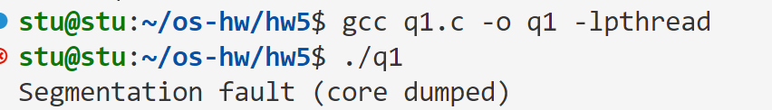

故应该在临界区内也判断是否应该结束进程（即是否满足index<MAX）。

```c
#include <unistd.h>
#include <stdio.h>
#include <stdlib.h>
#include <sys/time.h>
#include <pthread.h>
#define MAX 10000000
int data[MAX];
int cur = 0;
int flag[2];
int turn;
void* setdata(void* args){
    int start[2],end[2]={0, 0};
    int id = *(int*)args;
    while(cur<MAX){
        flag[id-1] = 1;  // 表自己ready进入临界区
        turn = id%2+1;    // 表权限给对方
        while(flag[id-1] && turn==id){
            //---------------------------------临界区----------------------------------
            if(cur>=MAX)    // 在临界区判断，不会被打断，避免判断和退出分离导致越界访问
                pthread_exit(NULL);
            start[id-1] = end[id-1];
            end[id-1] =  start[id-1]+200;
            // printf("%d, %d\n",start[id-1],end[id-1]);
            for(int i=start[id-1];i<end[id-1];i+=2) {
                data[cur] = i + id%2; //even ( i+1 for thread 2) 
                cur++;
            }
            //---------------------------------临界区----------------------------------
        }
        flag[id-1] = 0;
    }
    pthread_exit(NULL);
}

int main(){
    pthread_t t1,t2;
    struct timeval begin, end;
    int delta=-1;
    int id[] = {1, 2};
    gettimeofday(&begin, NULL);
    pthread_create(&t1, NULL, setdata, &id[0]);
    pthread_create(&t2, NULL, setdata, &id[1]);
    pthread_join(t1, NULL);
    pthread_join(t2, NULL);
    gettimeofday(&end, NULL);
    printf("Use %lf ms in total\n", (double)(end.tv_usec - begin.tv_usec)/1000);
    for(int i=0;i<MAX-1;i++){
        if(data[i+1]-data[i]>delta)
            delta=data[i+1]-data[i];
        else if(data[i]-data[i+1]>delta)
            delta=data[i]-data[i+1];
    }
    printf("The maximum of delta is: %d\n", delta);
}
```

**若需要二者严格交替进行**，就需要添加其他的约束，注意目前倘若线程2将turn置给1后，切换到线程1，此时线程1又将turn置为2，若恰好切换回线程1，将导致线程2连续运行两次，故在临界区中再判断一次是否误抢了锁（另一种解决办法是将turn直接置为`2-(cur/100)%2`）。

```c
#include <unistd.h>
#include <stdio.h>
#include <stdlib.h>
#include <sys/time.h>
#include <pthread.h>
#define MAX 10000000
int data[MAX];
int cur = 0;
int flag[2];
int turn;
void* setdata(void* args){
    int start[2],end[2]={0, 0};
    int id = *(int*)args;
    while(cur<MAX){
        flag[id-1] = 1;  // 表自己ready进入临界区
        turn = id%2+1;    // 表权限给对方
        while(flag[id-1] && turn==id){
            //---------------------------------临界区----------------------------------
            if(cur>=MAX)    // 在临界区判断，不会被打断，避免判断和退出分离导致越界访问
                pthread_exit(NULL);
            if((cur/100)%2==id-1)   //误抢到锁，释放
                break;
            start[id-1] = end[id-1];
            end[id-1] =  start[id-1]+200;
            // printf("%d, %d\n",start[id-1],end[id-1]);
            for(int i=start[id-1];i<end[id-1];i+=2) {
                data[cur] = i + id%2; //even ( i+1 for thread 2) 
                cur++;
            }
            //---------------------------------临界区----------------------------------
        }
        flag[id-1] = 0;
    }
    pthread_exit(NULL);
}

int main(){
    pthread_t t1,t2;
    struct timeval begin, end;
    int delta=-1;
    int id[] = {1, 2};
    gettimeofday(&begin, NULL);
    pthread_create(&t1, NULL, setdata, &id[0]);
    pthread_create(&t2, NULL, setdata, &id[1]);
    pthread_join(t1, NULL);
    pthread_join(t2, NULL);
    gettimeofday(&end, NULL);
    printf("Use %lf ms in total\n", (double)(end.tv_usec - begin.tv_usec)/1000);
    for(int i=0;i<MAX-1;i++){
        if(data[i+1]-data[i]>delta)
            delta=data[i+1]-data[i];
        else if(data[i]-data[i+1]>delta)
            delta=data[i]-data[i+1];
    }
    printf("The maximum of delta is: %d\n", delta);
}
```

#### 1.2 运行结果截图

让二者自由抢锁：

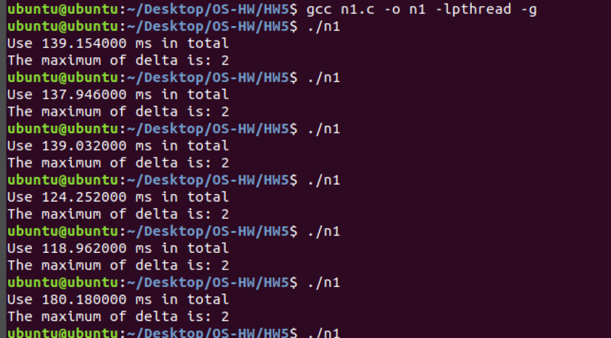

强制让二者交替进行：

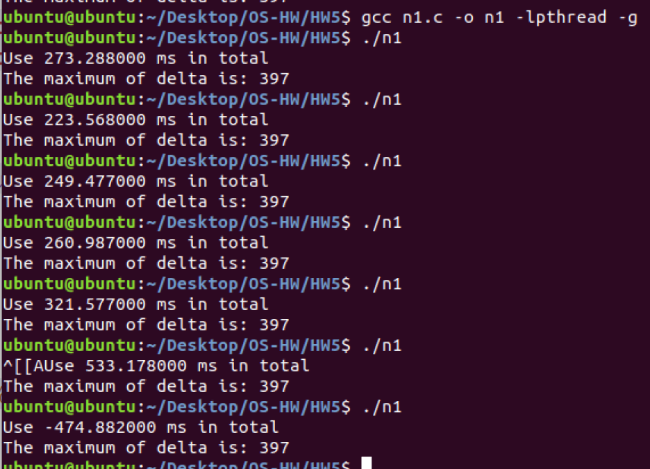

### 2. Mutex锁

#### 2.1 源代码

```c
#include <unistd.h>
#include <stdio.h>
#include <stdlib.h>
#include <sys/time.h>
#include <pthread.h>
#define MAX 10000000
int data[MAX];
int cur = 0;
pthread_mutex_t mutex ; //互斥锁

void* setdata(void* args){
    int start[2],end[2]={0, 0};
    int id = *(int*)args;
    while(cur<MAX){
        // if((cur/100)%2!=id-1 ){
            pthread_mutex_lock(&mutex);  //加锁
            //---------------------------------临界区----------------------------------
            start[id-1] = end[id-1];
            end[id-1] =  start[id-1]+200;
            for(int i=start[id-1];i<end[id-1];i+=2) {
                data[cur] = i + id%2; //even ( i+1 for thread 2) 
                cur++;
            }
            //---------------------------------临界区----------------------------------
            pthread_mutex_unlock(&mutex); //解锁
        // }
    }
    pthread_exit(NULL);
}

int main(){
    pthread_t t1,t2;
    struct timeval begin, end;
    int delta=-1;
    int id[] = {1, 2};
    gettimeofday(&begin, NULL);
    pthread_create(&t1, NULL, setdata, &id[0]);
    pthread_create(&t2, NULL, setdata, &id[1]);
    pthread_join(t1, NULL);
    pthread_join(t2, NULL);
    gettimeofday(&end, NULL);
    printf("Use %lf ms in total\n", (double)(end.tv_usec - begin.tv_usec)/1000);
    for(int i=0;i<MAX-1;i++){
        if(data[i+1]-data[i]>delta)
            delta=data[i+1]-data[i];
        else if(data[i]-data[i+1]>delta)
            delta=data[i]-data[i+1];
    }
    printf("The maximum of delta is: %d\n", delta);
}
```

#### 2.2 运行结果截图

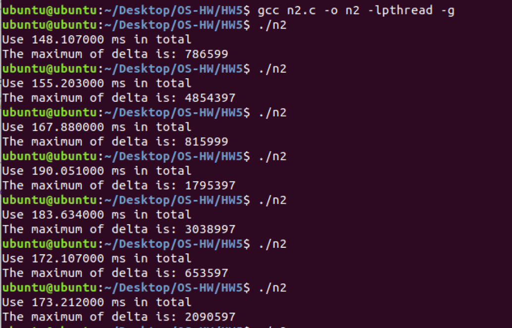

### 3. 原子操作

#### 3.0 背景知识

`_sync_fetch_and_add()`是C中一系列原子操作，可确保两个原本相对独立的步骤被“打包”执行，避免多线程运行的时候线程切换导致运行结果错误。大部分原子操作都是**full barrier**类型的，这意味着：任何内存操作的指令不允许跨越这些操作重新排序。

本次测验中使用了`_sync_lock_test_and_set`，为**acquire barrier**（意味着该操作之后的memory store指令不允许重排到该操作之前去，不过该操作之前的memory store可以排到该操作之后去），函数原型：

```c
type __sync_lock_test_and_set (type *ptr, type value, ...)
```

其将*ptr*设为*value*并返回*ptr*操作之前的值。若将ptr传入锁变量的指针，value传入1，跟踪其实现：

- 若ptr中原值为0，则置为1，返回值0，意味着抢到锁
- 若ptr中原值为0，则置为1，返回值1，意味着未抢到锁

据此将test和set的过程捆绑，确保检测“锁”和上“锁”的步骤不被分割。

使用`__sync_lock_release`进行相应的解“锁”操作，该操作是**release barrier**（意味着之前的memory store是全局可见的，所有的memory load也都完成了，但是接下来的内存读取可能会被排序到该操作之前执行），函数原型：

```c
type __sync_lock_release (type *ptr)
```

其将ptr中的值置为0，表示解锁。

> 参考材料：
>
> [__sync_fetch_and_add系列 - jiu~ - 博客园 (cnblogs.com)](https://www.cnblogs.com/jiu0821/p/7269542.html#:~:text=__sync_fetch_and_add系列一共有十二个函数，有加%2F减%2F与%2F或%2F异或%2F等函数的原子性操作函数%2C__sync_fetch_and_add%2C顾名思义，先fetch，然后自加，返回的是自加以前的值。 以count,%3D 4为例，调用__sync_fetch_and_add (%26count%2C1)%2C之后，返回值是4，然后，count变成了5.)
>
> [Linux内核API atomic_add|极客笔记 (deepinout.com)](https://deepinout.com/linux-kernel-api/linux-kernel-api-synchronization-mechanism/linux-kernel-api-atomic_add.html)

#### 3.1 源代码

```c
#include <unistd.h>
#include <stdio.h>
#include <stdlib.h>
#include <sys/time.h>
#include <pthread.h>
#include <stdatomic.h>
#define MAX 10000000
int data[MAX];
int cur = 0;
int locked; // 是否上锁

void* setdata(void* args){
    int start[2],end[2]={0, 0};
    int id = *(int*)args;
    while(cur<MAX){
        // if((cur/100)%2!=id-1 ){
            if(__sync_lock_test_and_set(&locked, 1)==0)//抢到锁
            {
                //---------------------------------临界区----------------------------------
                start[id-1] = end[id-1];
                end[id-1] =  start[id-1]+200;
                for(int i=start[id-1];i<end[id-1];i+=2) {
                    data[cur] = i + id%2; //even ( i+1 for thread 2) 
                    cur++;
                }
                //---------------------------------临界区----------------------------------
                __sync_lock_release(&locked); //解锁
            }
        // }

    }
    pthread_exit(NULL);
}

int main(){
    pthread_t t1,t2;
    struct timeval begin, end;
    int delta=-1;
    int id[] = {1, 2};
    gettimeofday(&begin, NULL);
    pthread_create(&t1, NULL, setdata, &id[0]);
    pthread_create(&t2, NULL, setdata, &id[1]);
    pthread_join(t1, NULL);
    pthread_join(t2, NULL);
    gettimeofday(&end, NULL);
    printf("Use %lf ms in total\n", (double)(end.tv_usec - begin.tv_usec)/1000);
    for(int i=0;i<MAX-1;i++){
        if(data[i+1]-data[i]>delta)
            delta=data[i+1]-data[i];
        else if(data[i]-data[i+1]>delta)
            delta=data[i]-data[i+1];
    }
    printf("The maximum of delta is: %d\n", delta);
}
```

#### 3.2 运行结果截图

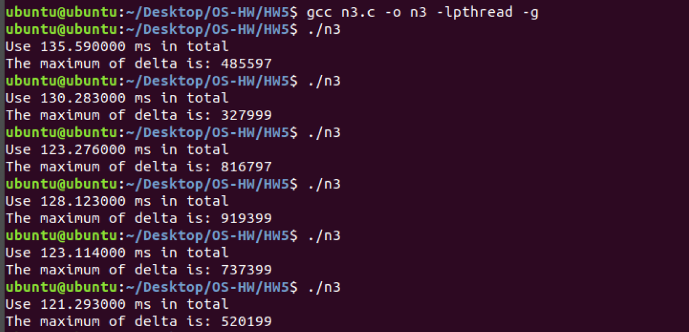

### 4. 比对分析

总体而言速度如下： 原子操作 > Peterson算法 > Mutex锁（但在测试中结果很不稳定，有时候又会有Peterson算法 > 原子操作 ），结合反汇编代码进行分析：

Peterson算法上“锁”和解“锁”过程：

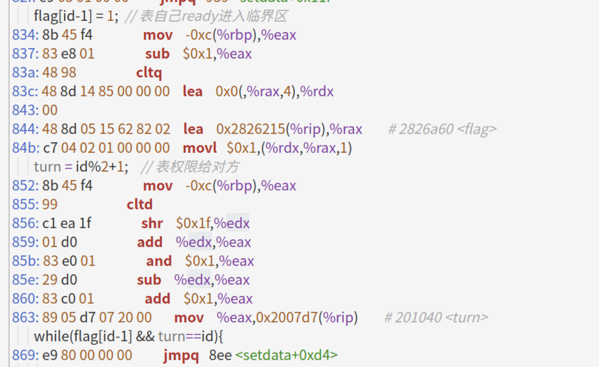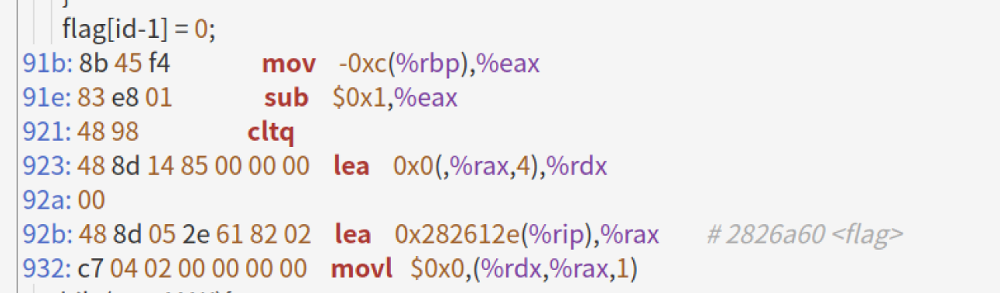

互斥锁上“锁”和解“锁”过程：

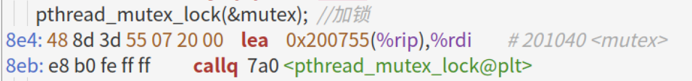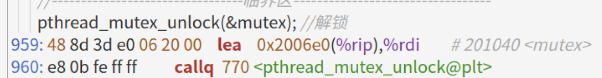

原子操作上“锁”和解“锁”过程：

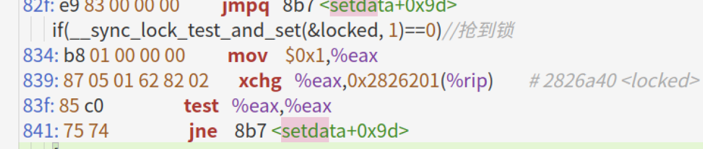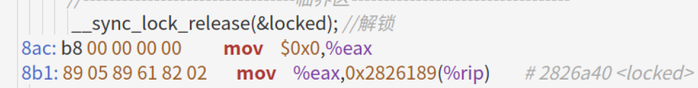

可见互斥锁实现是基于系统调用，其属于例外，其间会经历内核态和用户态的切换，导致耗时大大增加。而论解锁 、开锁的反汇编代码，原子操作比Peterson算法更简洁，但有时候运行时却是后者更占优势，猜测是因为原子操作的内存屏障特性导致运行时的流水线未能很好地进行优化调度。

> 原子操作的屏障特性可见：[Linux环境多线程编程基础设施 - Yebangyu's Blog](http://www.yebangyu.org/blog/2015/10/31/linux-parallen-programmming-infrastructure/)

## 5.2 线程交替

现有一个长度为5的整数数组，假设需要写一个两线程程序，其中，线程1负责往数组中写入5个随机数（1到20范围内的随机整数），写完这5个数后，线程2负责从数组中读取这5个数，并求和。该过程循环执行5次。注意：每次循环开始时，线程1都重新写入5个数。请思考：

1）上述过程能否通过pthread_mutex_lock/unlock函数实现？如果可以，请写出相应的源代码，并运行程序，打印出每次循环计算的求和值；如果无法实现，请分析并说明原因。 

提交: 实现题述功能的源代码和打印结果，或者无法实现的原因分析说明。

 

### 1. 源代码

```c
#include <unistd.h>
#include <stdio.h>
#include <stdlib.h>
#include <sys/time.h>
#include <pthread.h>
#define MAX 5
int data[MAX];
int cur = 0;
pthread_mutex_t mutex ; //互斥锁
pthread_mutexattr_t attr;   //锁属性
void* setdata(void* args){
    int sum1;
    for(int j=0;j<MAX;){
        pthread_mutex_lock(&mutex);  //加锁
        //---------------------------------临界区----------------------------------
        j++;
        sum1=0;
        for(int i=0;i <MAX; i++){
            data[i]=rand()%20;
            sum1+=data[i];
        }
        printf("Thread 1 result: %d.\n", sum1);
        //---------------------------------临界区----------------------------------
        pthread_mutex_unlock(&mutex); //解锁
    }
    pthread_exit(NULL);
}
void* redata(void* args){
    int sum2;
    for(int j=0;j<MAX;){
        pthread_mutex_lock(&mutex);  //加锁
        //---------------------------------临界区----------------------------------
        j++;
        sum2=0;
        for(int i=0;i <MAX; i++){
            sum2+=data[i];
        }
        printf("Thread 2 result: %d.\n", sum2);
        //---------------------------------临界区----------------------------------
        pthread_mutex_unlock(&mutex); //解锁
    }
    pthread_exit(NULL);
}
int main(){
    pthread_t t1,t2;
    pthread_mutexattr_init(&attr);  //初始化锁属性
    pthread_mutexattr_settype(&attr, PTHREAD_MUTEX_TIMED_NP);
    pthread_mutex_init(&mutex, &attr);                  //将对应的锁设置为配置的属性
    pthread_create(&t1, NULL, setdata, NULL);
    pthread_create(&t2, NULL, redata, NULL);
    pthread_join(t1, NULL);
    pthread_join(t2, NULL);
    pthread_mutexattr_destroy(&attr);                //销毁创建的锁属性
}
```

### 2. 运行结果截图

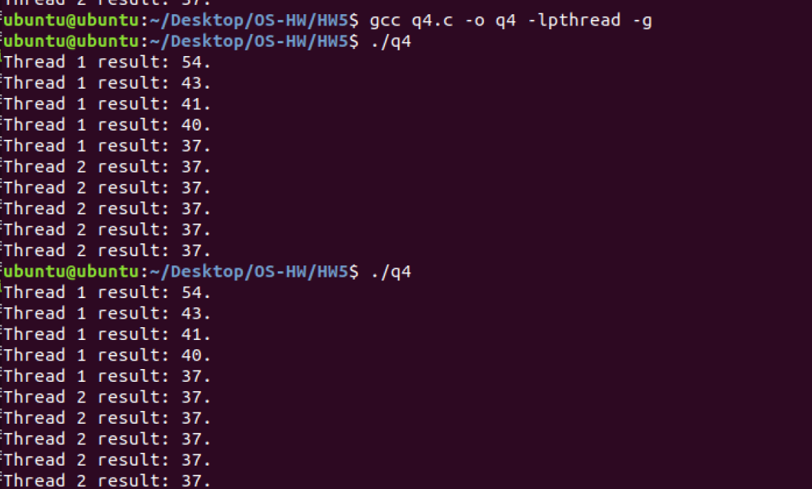

### 3. 过程分析

起初直接采用5.1中的互斥锁设计模式，发现结果皆是线程1运行完5个循环后才切换至线程2，最开始我以为是线程1反复抢到锁的缘故，后查询资料得知可以为锁初始化一个属性，确保其使用轮流调度的策略：

> [(3条消息) 多个线程同时抢一把锁出现的问题与处理方式_VClol的博客-CSDN博客_线程抢锁](https://blog.csdn.net/qq_40334837/article/details/83862269)

但加上属性后结果依旧，猜测是由于**循环次数较少**，线程1释放锁后进入下一个循环，未曾切换到线程2就又抢到了锁，也即**线程2直到线程1执行结束后才开始申请锁**，gdb跟踪验证：

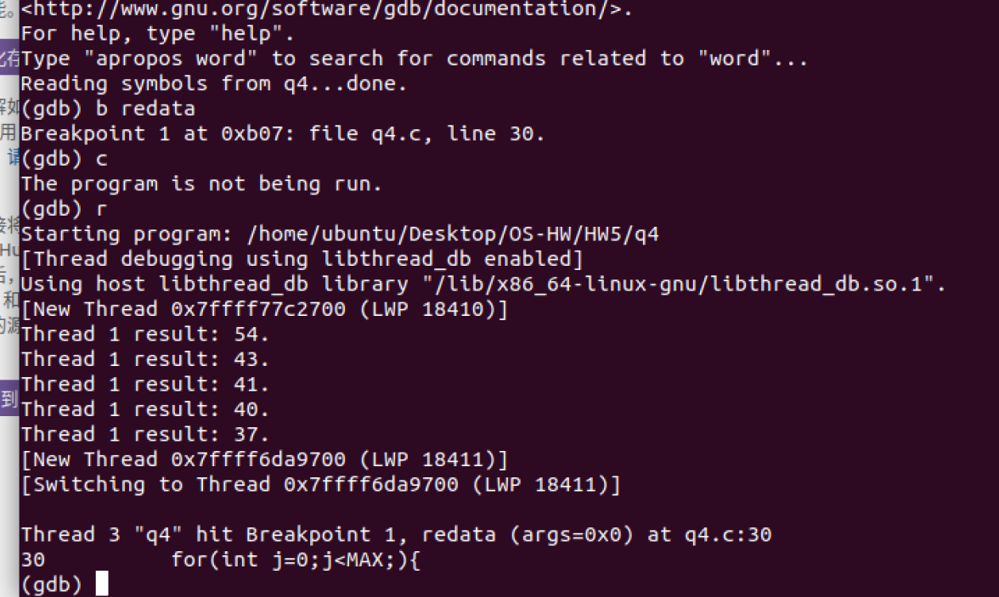

将断点打在线程2 的入口，发现直到线程1全部运行完后才切换到线程2。

### 4. 尝试实现功能

#### 4.1 维护一个turn变量

参考Peterson算法的思路引入一个turn变量，以置数的线程的为例，其代码为：

```c
void* setdata(void* args){
    int sum1;
    for(int j=0;j<MAX;){
        turn = 2;
        pthread_mutex_lock(&mutex);  //加锁
        //---------------------------------临界区----------------------------------
        if(turn!=1){
            pthread_mutex_unlock(&mutex); //解锁
            continue;
        }
        j++;
        sum1=0;
        for(int i=0;i <MAX; i++){
            data[i]=rand()%20;
            sum1+=data[i];
        }
        printf("Thread 1 result: %d.\n", sum1);
        //---------------------------------临界区----------------------------------
        pthread_mutex_unlock(&mutex); //解锁
    }
    pthread_exit(NULL);
}
```

但此种方法缺点诸多，比如最后一次运算完后切换至线程2时，线程2将turn还给1后进入死循环：

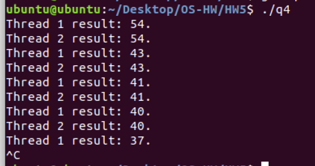

同时需要注意的是第二个取数线程需先于置数线程创建，才能更大概率（偶尔还是会出现线程2先进行读数的情况）地使置数过程先进行。

故希望使得`turn`只与一个“客观”的变量有关（即全局变量），不受进程影响，仿照5.1中强制让二者切换的思路，可考虑维护一组round变量，round的相对大小其实就隐含着turn的信息。

#### 4.2 维护一组round变量

记录线程1和2分别执行了几次循环，并要求round1和round2尽可能并驾齐驱地update。具体实现方法是在让线程1和2分别在临界区内判断是否有`round1>round2`和`round2>=round1`（注意取等条件），若成立则把锁让出。

线程函数代码如下：

```c
void* setdata(void* args){
    int sum1;
    for(round1=0;round1<MAX;){
        pthread_mutex_lock(&mutex);  //加锁
        //---------------------------------临界区----------------------------------
        if(round1>round2){
            pthread_mutex_unlock(&mutex); //解锁
            continue;
        }
        round1++;
        sum1=0;
        for(int i=0;i <MAX; i++){
            data[i]=rand()%20;
            sum1+=data[i];
        }
        printf("Thread 1 result: %d.\n", sum1);
        //---------------------------------临界区----------------------------------
        pthread_mutex_unlock(&mutex); //解锁
    }
    pthread_exit(NULL);
}
void* redata(void* args){
    int sum2;
    for(round2=0;round2<MAX;){
        pthread_mutex_lock(&mutex);  //加锁
        //---------------------------------临界区----------------------------------
        if(round2>=round1){
            pthread_mutex_unlock(&mutex); //解锁
            continue;
        }
        round2++;
        sum2=0;
        for(int i=0;i <MAX; i++){
            sum2+=data[i];
        }
        printf("Thread 2 result: %d.\n", sum2);
        //---------------------------------临界区----------------------------------
        pthread_mutex_unlock(&mutex); //解锁
    }
    pthread_exit(NULL);
}
```

这样可保证二者交替进行，且线程1总是先于线程2（置数先于读数）进行。

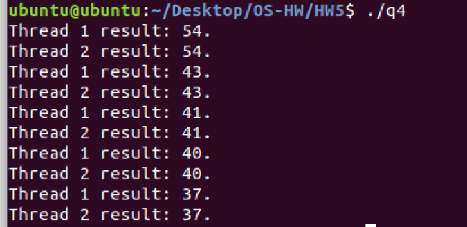

 
