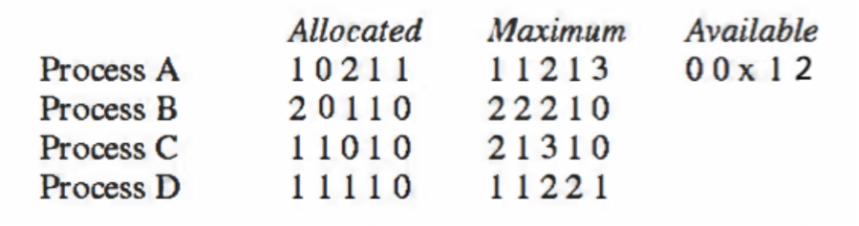

# OS作业6

    林孟颖 2020K8009915008

[TOC]

## 6.1 进程资源分配

某系统存在4个进程和5份可分配资源，当前的资源分配情况和最大需求如下表所示。求满足安全状态下X的最小值。请写出解题分析过程。

 

**解题分析过程：**

设五种资源分别为R1, R2, R3, R4, R5。

当前资源请求矩阵：

|      | R1   | R2   | R3   | R4   | R5   |
| ---- | ---- | ---- | ---- | ---- | ---- |
| A    | 0    | 1    | 0    | 0    | 2    |
| B    | 0    | 2    | 1    | 0    | 0    |
| C    | 1    | 0    | 3    | 0    | 0    |
| D    | 0    | 0    | 1    | 1    | 1    |

假设`x=0`，则无法分配资源使得任何一个进程可以获得所需全部资源。

假设`x=1`，则满足可D的需求，将资源分配给D后资源请求矩阵：

|      | R1   | R2   | R3   | R4   | R5   |
| ---- | ---- | ---- | ---- | ---- | ---- |
| A    | 0    | 1    | 0    | 0    | 2    |
| B    | 0    | 2    | 1    | 0    | 0    |
| C    | 1    | 0    | 3    | 0    | 0    |
| D    | 0    | 0    | 0    | 0    | 0    |

D退出后可用资源向量：
| R1   | R2   | R3   | R4   | R5   |
| ---- | ---- | ---- | ---- | ---- |
| 1    | 1    | 2    | 1    | 2    |

可满足A的需求，资源分配给A后资源请求矩阵：

|      | R1   | R2   | R3   | R4   | R5   |
| ---- | ---- | ---- | ---- | ---- | ---- |
| A    | 0    | 0    | 0    | 0    | 0    |
| B    | 0    | 2    | 1    | 0    | 0    |
| C    | 1    | 0    | 3    | 0    | 0    |
| D    | 0    | 0    | 0    | 0    | 0    |

A退出后可用资源向量：

| R1   | R2   | R3   | R4   | R5   |
| ---- | ---- | ---- | ---- | ---- |
| 1    | 2    | 2    | 1    | 4    |

可满足B的需求，资源分配给B后资源请求矩阵：

|      | R1   | R2   | R3   | R4   | R5   |
| ---- | ---- | ---- | ---- | ---- | ---- |
| A    | 0    | 0    | 0    | 0    | 0    |
| B    | 0    | 0    | 0    | 0    | 0    |
| C    | 1    | 0    | 3    | 0    | 0    |
| D    | 0    | 0    | 0    | 0    | 0    |

B退出后可用资源向量：

| R1   | R2   | R3   | R4   | R5   |
| ---- | ---- | ---- | ---- | ---- |
| 1    | 4    | 3    | 1    | 4    |

可满足C的需求，分配后C可释放资源。

故**安全状态下x的最小值为1**。

## 6.2 调度顺序与死锁

两进程A和B各需要数据库中的3份记录1、2、3，若进程A以1、2、3的顺序请求这些资源， 进程B也以同样的顺序请求这些资源，则将不会产生死锁。但若进程B以3、2、1的顺序请求这些资源，则可能会产生死锁。这3份资源存在6种可能的请求顺序，其中哪些请求顺序能保证无死锁产生？请写出解题分析过程。

### （1）1、2、3

- 假设A抢到资源1，则B申请资源1时会被block而挂起，此后A可毫无竞争地继续申请资源2，3，不会产生死锁 。

- B先抢到则同理。

### （2）1、3、2

- 假设A抢到资源1，则B申请资源1时会被block而挂起，此后A可毫无竞争地继续申请资源2，3，不会产生死锁 。

- 假设B抢到资源1，则A申请资源1时会被block而挂起，此后B可毫无竞争地继续申请资源3，2，不会产生死锁 。

### （3）2、1、3

- 假设A先抢到资源1，此后B抢到资源2；
- A继续申请资源2，被阻塞挂起；
- B继续申请资源1，被阻塞挂起；

形成死锁。

### （4）2、3、1

- 假设A先抢到资源1，此后B抢到资源2，3；
- A继续申请资源3，被阻塞挂起；
- B继续申请资源1，被阻塞挂起；

形成死锁。

### （5）3、1、2

- 假设A先抢到资源1、2，此后B抢到资源3；
- A继续申请资源3，被阻塞挂起；
- B继续申请资源1，被阻塞挂起；

形成死锁。

### （6）3、2、1

由于A和B申请资源的顺序严格相反，故只可能出现三种情况：

- A申请到全部资源
- A和B都先抢了部分资源
- B申请到全部资源

第一种和第三种不会出现死锁，故此处只关注第二种情况：

- 假设A先抢到资源1、2，此后B抢到资源3；
- A继续申请资源3，被阻塞挂起；
- B继续申请资源2，被阻塞挂起；

形成死锁。

### （7）总结

综上，当B申请资源的顺序为123或者132时不会出现死锁，其他都有可能出现死锁。

其本质原因是在**申请第一种资源时其中一个进程必定直接被阻塞**，而不会继续申请其他资源。而对其他申请资源的顺序，**都有可能出现A持有部分资源，且B持有部分资源的情况**，由于**二者的最终目标都是抢到全部资源，故此时必定产生死锁**。
