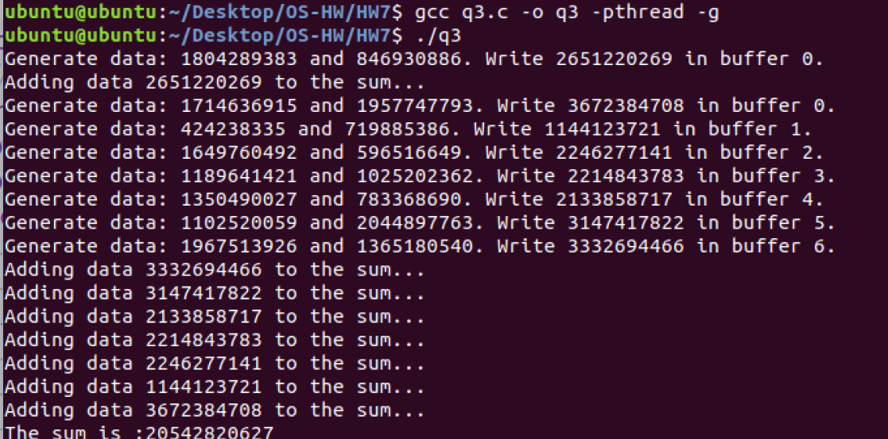
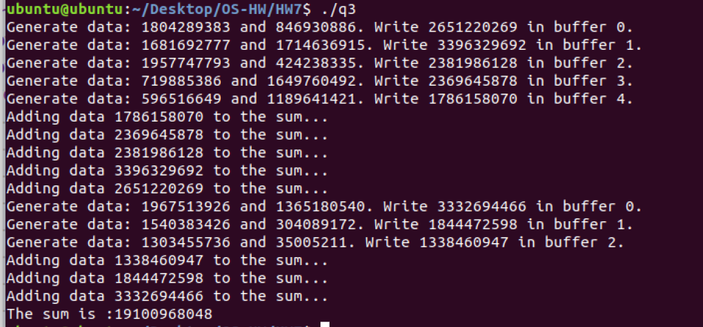

# OS作业7
<center>
    林孟颖 2020K8009915008
</center>
[TOC]

## 1. 信号量与线程执行顺序

设有两个优先级相同的进程 T1，T2 如下。令信号量 S1，S2 的初值为 0，已知 z=2，试

问 T1，T2 并发运行结束后 x=? y=? z=? 

线程 T1 

```
y:=1;
y:=y+2; 
V(S1);
z:=y+1;
P(S2);
y:=z+y; 
```

线程 T2 

```
x:=1; 
x:=x+1; 
p(S1); 
x:=x+y; 
V(S2); 
z:=x+z; 
```

注:请分析所有可能的情况，并给出结果与相应执行顺序。 

-----


由于S1和S2的初始值都是0，故只有对之做V操作才不会被阻塞，故在T1执行到`V(S1)`前T2一定会被阻塞在`p(S1)`，而T2在执行`p(S1)`不会对共享变量z做操作，对T1没有影响，故无需考虑T1执行到`V(S1)`前T1执行到何处。

同理，在T2执行到`V(S2)`前T1一定会被阻塞在`p(S2)`，但T1从`V(S1)`执行到`p(S2)`的过程中只用到y的值，并修改z变量的值；而T2从`p(S1)`执行到`V(S2)`的过程中只用到x和y的值，并修改x变量的值，故在T1运行到`V(S1)`后且被阻塞到`p(S2)`、T2运行到`V(S2)`时二者指令的执行顺序不会影响x、y的值。

则T2运行到`V(S2)`时，x=5，y=3，下讨论T2运行到`V(S2)`后（此时一定有T1已经运行到`V(S1)`以后）的情况：

**情况1：**

- (T1) z=y+1，即z=4
- (T2) z=x+z，即z=9
- (T1) y=z+y，即y=12

最终值：x=5，y=12，z=9

**情况2：**

- (T1) z=y+1，即z=4
- (T1) y=z+y，即y=7
- (T2) z=x+z，即z=9

最终值：x=5，y=7，z=9

**情况3：**

- (T2) z=x+z，z初始2，即z=7
- (T1) z=y+1，即z=4
- (T1) y=z+y，即y=7

最终值：x=5，y=7，z=7

## 2. 柜台模拟

银行有 n 个柜员,每个顾客进入银行后先取⼀个号,并且等着叫号,当⼀个柜员空闲后,就

叫下⼀个号. 

请使用 PV 操作分别实现: 

//顾客取号操作 Customer_Service 

//柜员服务操作 Teller_Service 

```c
#include <unistd.h>
#include <stdio.h>
#include <stdlib.h>
#define N 10
int teller_free=N;    // 表示空闲柜员个数为N
int custom_num=0;    // 当前待服务的顾客个数
void P(int* sem);// P操作
void V(int* sem);// V操作
void signal(int sem);   //释放一个由于sem而堵塞的线程
//顾客取号操作 Customer_Service 
void Customer_Service(){
    while(1){
        wait(rand()%5); // 模拟顾客陆续到来
        V(&custom_num);
    }
}
//柜员服务操作 Teller_Service 
void Teller_Service(){
    while(1){
        P(&teller_free);
        P(&custom_num);
        // --------服务-----------
            // ……
        // --------服务-----------
        V(&teller_free);    // 服务结束
    }
}
```


## 3. 多线程规约

多个线程的规约(Reduce)操作是把每个线程的结果按照某种运算(符合交换律和结合律)

两两合并直到得到最终结果的过程。 

试设计管程 monitor 实现⼀个 8 线程规约的过程，随机初始化 16 个整数，每个线程通过 

调用 monitor.getTask 获得 2 个数，相加后，返回⼀个数 monitor.putResult ，然后再 

getTask( ) 直到全部完成退出，最后打印归约过程和结果。 

要求: 为了模拟不均衡性，每个加法操作要加上随机的时间扰动，变动区间 1~10ms。 

>提示: 使用 pthread_系列的 cond_wait, cond_signal, mutex 实现管程 
>
>使用 rand( )函数产生随机数，和随机执行时间

### 3.1 背景知识

#### 3.1.1 管程简介

- 功能：管程实现了互斥访问，保证同一个时刻只能由一个线程在管程内。
- 编程语言支持管程的方法：
  - 法一：让对象内部包含`semaphore`, `mutex`, `condition_variable`；
  - 法二：使用pthread的条件变量API。

- 管程的语义
  - Mesa： monitor有wait queue和entry queue， 那么， 一个线程要么在wait queue中， 要么在entry queue中， 要么在管程中。**线程A被signal后，线程B继续在管程中，线程A进入entry queue，等线程B离开管程，线程A再进入管程**。
  - Brinch Hansen： 要求signal发生在线程A离开管程的时候，也就是说，signal之后，线程B就离开管程了，线程A就自然进入管程。
  - Hoare：除却上述两种queue，还有**signal queue**。等的线程A在wait queue，signal发生时，线程B被从管程中移到signal queue中，而线程A则从wait queue移到管程中，等线程A离开管程后线程B再回来。

#### 3.1.2 pthread管程相关的API

- `pthread_cond_wait`：

  pthread_cond_wait()函数等待条件变量变为真的。它需要两个参数，第一个参数就是条件变量，而第二个参数mutex是保护条件变量的互斥量。也就是说这个函数在使用的时候需要配合pthread_mutex_lock()一起使用。

  ```c
  pthread_mutex_lock(&mutex);
  pthread_cond_wait(&cond,&mutex);
  ```

  该函数功能：

  1. 等待条件变量满足； 

  2. 把获得的锁释放掉；（注意：1，2两步是一个**原子操作**）

     > 释放锁这一步和等待条件满足一定是一起执行

  > [线程同步之条件变量（pthread_cond_wait） - 腾讯云开发者社区-腾讯云 (tencent.com)](https://cloud.tencent.com/developer/article/1629561#:~:text=1 等待条件变量满足； 2 把获得的锁释放掉；（注意：1，2两步是一个原子操作）  当然如果条件满足了，那么就不需要释放锁。,所以释放锁这一步和等待条件满足一定是一起执行（指原子操作）。 3 pthread_cond_wait ()被唤醒时，它解除阻塞，并且尝试获取锁（不一定拿到锁）。 因此，一般在使用的时候都是在一个循环里使用pthread_cond_wait ()函数，因为它在返回的时候不一定能拿到锁（这可能会发生饿死情形，当然这取决于操作系统的调度策略）。)

- `pthread_cond_signal()`：
  激活**一个**等待该条件的线程，存在多个等待线程时按入队顺序激活其中一个；
- `pthread_cond_broadcast`释放了**所有**堵在cond上的进程。

#### 3.1.2 semaphore相关的API

可在`/usr/include/semaphore.h`中寻找，其中结构体定义于`/usr/include/bits/semaphore.h`

```c
int sem_init(sem_t *sem,int pshared,unsigned int value); 	// 初始化信号量
int sem_destroy(sem_t *sem); 	// 销毁信号量
int sem_wait(sem_t *sem); 		// 相当于down操作，会阻塞
int sem_trywait(sem_t *sem); 	// 仅查看是否可获取资源，不阻塞
int sem_post(sem_t *sem); 		// 相当于up操作
int sem_getvalue(sem_t *sem); 	// 获取信号量的值
```


### 3.2 代码

```c
#include <unistd.h>
#include <stdio.h>
#include <stdlib.h>
#include <pthread.h>
#include <semaphore.h>
#define N 8

long long buffer[N];
// monitor相关变量与函数
int offset=0; // 当前写的数据个数，初始化为0表示buffer空
pthread_mutex_t mutex = PTHREAD_MUTEX_INITIALIZER;
pthread_cond_t buffer_empty = PTHREAD_COND_INITIALIZER;
void* getTask(void* args){
    long long data1, data2;
    pthread_mutex_lock(&mutex);
    data1 = rand();
    data2 = rand();
    buffer[offset] = data1+data2;
    printf("Generate data: %lld and %lld. Write %lld in buffer %d.\n", data1, data2, buffer[offset], offset);
    offset++;
    pthread_cond_signal(&buffer_empty);
    pthread_mutex_unlock(&mutex);
    pthread_exit(NULL);
}
void* putResult(void *args){
    int count=0;
    long long sum=0;
    while(count<N){
        pthread_mutex_lock(&mutex);
        while(offset==0)
            pthread_cond_wait(&buffer_empty, &mutex);
        while(offset>0){
            --offset;
            printf("Adding data %lld to the sum...\n", buffer[offset]);
            usleep((rand()%10)*1000);
            sum+=buffer[offset];
            count++;
        }
        pthread_mutex_unlock(&mutex);
    }
    printf("The sum is :%lld\n", sum);
    pthread_exit(NULL);
}
int main(){
    pthread_t child[N], calc;
    int i;
    // 创建一个线程用于求和
    pthread_create(&calc, NULL, &putResult, NULL);
    // 创建N个线程，产生数据
    for(i=0; i<N; i++){
        pthread_create(&child[i], NULL, &getTask, NULL);
    }
    //等待所有线程结束
    for(i=0; i<N; i++)
        pthread_join(child[i], NULL);
    pthread_join(calc, NULL);
    return 0;
}

```

### 3.3 运行效果截图




