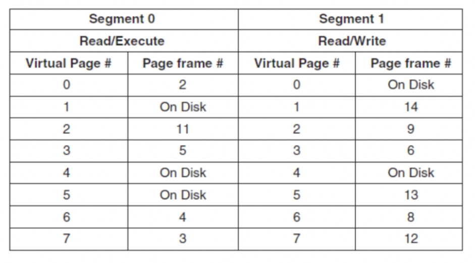

# OS作业9
<center>
    林孟颖 2020K8009915008
</center>
#### 9.1 

假设一台计算机上运行的一个进程其地址空间有8个虚页（每个虚页大小为4KB，页号为1至8），操作系统给该进程分配了4个物理页框（每个页框大小为4KB），该进程对地址空间中虚页的访问顺序为 1 3 4 6 2 3 5 4 7 8。假设分配给进程的4个物理页框初始为空，请计算：

（1）如果操作系统采用FIFO算法管理内存，那么该进程访存时会发生多少次page fault？当进程访问完上述虚页后，物理页框中保存的是哪些虚页？

（2）如果操作系统采用LRU算法管理内存，请再次回答（1）中的两个问题

 **1）**由题，所给物理页框可存放至多4个虚页，初始状态为空，则读入首4个不同页时皆会发生page fault，此时页框内存储情况为：

| 1    | 3    | 4    | 6    |
| ---- | ---- | ---- | ---- |

此时再访问虚页2，未存储在已有物理页框内，发生page fault，并进行页替换，换出首个页：

| 3    | 4    | 6    | 2    |
| ---- | ---- | ---- | ---- |

再访问虚页3，hit；再访问虚页5，发生page fault并进行页替换，换出首个页：

| 4    | 6    | 2    | 5    |
| ---- | ---- | ---- | ---- |

访问虚页4，hit；访问虚页7与8，皆会发生page fault并进行页替换，换走首两个页：

| 2    | 5    | 7    | 8    |
| ---- | ---- | ---- | ---- |

故一共发生4+1+1+1+1=8次页错误，最后保存的是2、5、7、8虚页。

**2）**同样，读入首4个不同页时皆会发生page fault，此时页框内存储情况为：

| 1    | 3    | 4    | 6    |
| ---- | ---- | ---- | ---- |

此时再访问虚页2，未存储在已有物理页框内，发生page fault，并进行页替换，最近最少使用的是首个页，替换得：

| 3    | 4    | 6    | 2    |
| ---- | ---- | ---- | ---- |

再访问虚页3，hit；

| 4    | 6    | 2    | 3    |
| ---- | ---- | ---- | ---- |

再访问虚页5，发生page fault并进行页替换，最近最少使用的是虚页4，替换：

| 6    | 2    | 3    | 5	|
| ---- | ---- | ---- | ---- |

访问虚页4，发生page fault，最近最少使用的是虚页6，替换：

| 2    | 3    | 5	 | 4	|
| ---- | ---- | ---- | ---- |

访问虚页7，发生page fault，最近最少使用的是虚页2，替换：

| 3    | 5    | 4	 | 7	|
| ---- | ---- | ---- | ---- |

访问虚页8，发生page fault，最近最少使用的是虚页3，替换：

| 5    | 4    | 7    | 8    |
| ---- | ---- | ---- | ---- |

故一共发生4+1+1+1+1+1=9次页错误，最后保存的是5、4、7、8虚页。


---

#### 9.2 

假设一台计算机给每个进程都分配4个物理页框，每个页框大小为512B。现有一个程序对一个二维整数数组（uint32 X\[32]\[32]）进行赋值操作，该程序的代码段占用一个固定的页框，并一直存储在内存中。程序使用剩余3个物理页框存储数据。该程序操作的**数组X以列存储形式**保存在磁盘上，即X\[0]\[0]后保存的是X\[1]\[0]、X\[2]\[0]…X\[31]\[0]，然后再保存X\[0]\[1]，以此类推。当程序要赋值时，如果所赋值的数组元素不在内存中，则会触发page fault，操作系统将相应元素**以页框粒度交换至内存**。如果该进程的物理页框已经用满，则会进行页换出。该程序有如下两种写法。

```c
写法1：
for(int i=0;i<32;i++)
  for(int j=0;j<32;j++)
   X[i][j] = 0

写法2：
for(int j=0;j<32;i++)
  for(int i=0;i<32;j++)
   X[i][j] = 0
```

请分析使用这两种写法时，各自会产生多少次page fault？（注：请写出分析或计算过程）


一个页框大小512B，一个`uint32`类型元素占4B，故一个页框内可存储$\frac{512}{4}=128$个该类型数据。

  **写法一：按行序访问**

由于数据按列序存储，则内循环中相邻的访问数据在内存中的gap实际为$32\times 4B=128B$，故每次发生页替换后，后续的$\lfloor{\frac{512}{128}}\rfloor-1=3$个数据不会发生页错误，也就是内循环以4为周期发生page fault，会发生$\lceil {\frac{32}{4}} \rceil = 8$次页错误；

同时，由于物理页框总数为4，默认采用FIFO算法，发生8次页错误后进行替换，则物理页框内存储的是含`X[16]`\~`X[31]`数据的页，下一轮内循环开始的前半论循环访问的是`X[0]`\~`X[15]`数据的页框，照例以4为周期发生页错误，同时会将当前物理页框中的数据完全替换走，后半轮循环也会以4为周期发生页错误。

共计$8\times 32 = 256$次页错误。

**写法二：按列序访问**

此时循环中相邻被访问的数据在内存中的gap实际为$4B$，而两层循环共需访问$32\times 32 = 1024$个数据，故共会触发$\lceil {\frac{1024}{128}} \rceil = 8$次页错误。

---

#### 9.3 

假设一个程序有两个段，其中段0保存代码指令，段1保存读写的数据。段0的权限是可读可执行，段1的权限是可读可写，如下所示。该程序运行的内存系统提供的**虚址空间为14-bit空间，其中低10-bit为页内偏移，高4-bit为页号**。

 

当有如下的访存操作时，请给出每个操作的实际访存物理地址或是产生的异常类型（例如缺页异常、权限异常等）


设物理页框大小N，起始地址0x0

**（1） 读取段1中page 1的offset为3的地址**

由图可知，段1中page 1已经对应于第2个物理页框，同时段1的权限为可读可写，读操作不会发生异常。其实地址为$14N+3$；

**（2） 向段0中page 0的offset为16的地址写入**

由图可知，段0中page 0已经对应于第14个物理页框，但段0的权限为可读可执行，写操作会触发权限异常。其实地址为$2N+16$；

**（3） 读取段1中page 4的offset为28的地址**

由图可知，段1中page 4 还存储在磁盘上，会触发缺页异常。其实地址取决于后续其load进内存的物理块号，设之为M，则实地址$MN+28$；

**（4） 跳转至段1中page 3的offset为32的地址**

 由图可知，段1中page 3 已经对应于第6个物理页框，但段1的权限为可读可写行，执行操作会触发权限异常。其实地址为$6N+32$.

