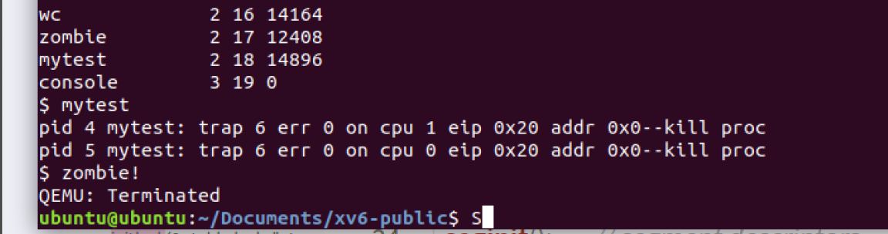
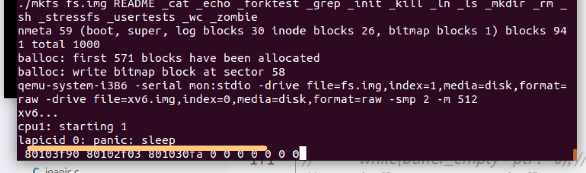
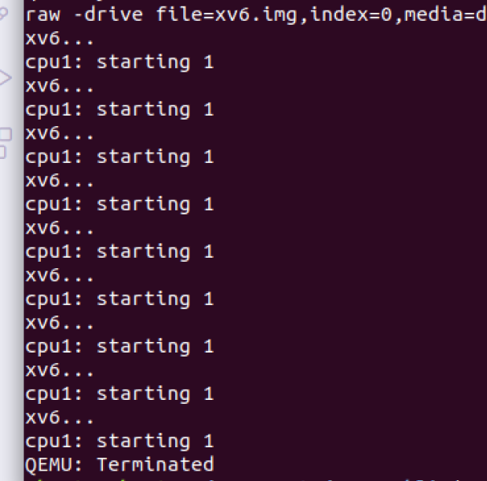
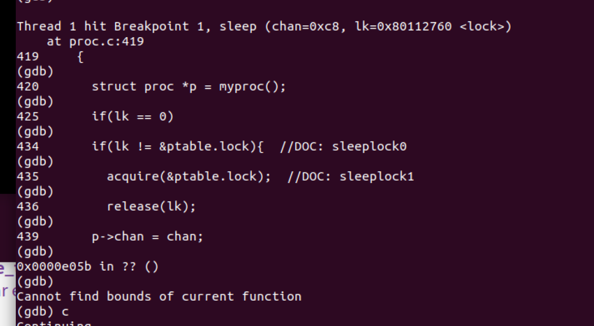

# 第⼆部分 

## 一.条件变量 

相关文件： proc.c 重点关注问题：

1. 请查阅资料，给出 pthread 提供的条件变量操作，并与xv6提供的 sleep & wakeup 操作比较。 
2.  为什么 sleep 需要⼀个 lk 作为参数？（可以参照xv6配套讲义中sleep and wakeup⼀节中的 代码改进过程进行说明） 
3. 为什么 sleep （以及 wakeup ）要使用 ptable.lock ？xv6如何通过锁的使用来解决lost wake-up问题？ 
4. sleep 函数中，2890行if语句的作用是什么？
5. sleep 函数中，2891行和2892行能不能交换顺序？为什么？ 
6. 阐述 sleep 函数执行时，进程是如何转入睡眠态，⼜转入就绪态和运行态，并继续执行sleep 的。 
7. xv6的 wakeup 操作，为什么要拆分成 wakeup 和 wakeup1 两个函数，请举例说明。 
8. 假设 wakeup 操作唤醒了多个等待相同 channel 的进程，此时这多个进程会如何执行？xv6的 wakeup 是否符合Mesa semantics？ 
9. wakeup 时如果没有 sleeping 的进程， wakeup 会阻塞吗？ 


> 1）为什么`sleep`要获取`ptable.lock`？
>
> 因为在真正把进程设置为`SLEEP`状态之前，子进程可能就已经成为僵死进程并在`exit()`函数中调用了`wakeup1()`来唤醒父进程，但此时父进程还未`SLEEP`，这会使得父进程接收不到`wakeup`信号从而进入死锁状态。这种现象的原因是睡眠操作与检测睡眠条件不是一个**原子操作**，xv6让进程在`SLEEP`之前获取了`ptable.lock`，而`exit()`调用`wakeup`又必须要获取`ptable.lock`，所以不会发生`lose wakeup`。
>
> 2）`sleep`一直占着`ptable.lock`，哪里有释放才能使其他进程获取锁？
>
> 在xv6中，`ptable.lock`总是由旧进程获得，并将锁的控制权转移给切换代码，由新进程释放。锁的这种使用方式很少见，通常来说，持有锁的线程应该负责释放该锁，这样更容易让我们理解其正确性。但对于上下文切换来说，我们必须使用这种方式，因为 `ptable.lock` 会保证进程的 `state` 和 `context` 在运行 `swtch` 时保持不变。如果在 `swtch` 中没有持有 `ptable.lock`，可能引发这样的问题：在 yield 将某个进程状态设置为 `RUNNABLE` 之后，但又是在 `swtch` 让它停止在其内核栈上运行之前，有另一个 CPU 的schduler检测到该进程位`RUNNABLE`，然后调用`swtch`，结果将是两个 CPU 都运行在同一个栈上，这显然是不该发生的。这里也可以解释为什么在第一个进程中要把`context`的`eip`设为forkret，就是为了按照惯例释放 `ptable.lock`，否则这个新进程是可以直接从从 `trapret` 就开始执行的。 所以在进程被置为SLEEPING之后要`give up CPU`，并不由当前进程释放锁，而是调用`sched()`，`sched()`会通过下面这句切换到`scheduler`：
>
> ```
> swtch(&p->context, mycpu()->scheduler);
> ```
>
> 而前面说过所有内核线程被切换掉时都会被卡在`swtch`，`scheduler`也不例外，所以`scheduler`会从swtch开始继续往下执行。而下面正有 `release(&ptable.lock);`
>
> 3）为什么有`lk`锁，为什么可以释放？
>
> 因为调用`sleep`的不一定是`wait`，比如发送者和接收者也需要调用sleep和wakeup（详细的例子参考[xv6调度\[睡眠与唤醒\]](http://www.mamicode.com/info-detail-2514856.html)）。sleep的调用者必须持有锁，这个锁不是ptable.lock，是保证二者比如发送者和接收者操作原子性的锁，作用是防止在调用者在test和sleep之间，对手进程在另一个cpu上运行，更新了共享量，调用了wakeup却发现没有需要唤醒的进程，导致对手进程被阻塞在test上，而调用者进程也依然sleep，这就造成死锁。接着 sleep 要求持有 ptable.lock。于是该进程就会同时持有锁 ptable.lock 和 lk 了。而如今 sleep 已经持有了 ptable.lock，因为wakeup一定要持有ptable.lock，所以即便对手进程调用了wakeup，wakeup 也不可能在没有持有 ptable.lock 的情况下运行直至sleep 让进程睡眠后，所以此时sleep完全可以释放lk，让对手进程能够修改共享量防止另一种死锁，同时这样一来，wakeup也 不会错过 sleep 。
>
> 在这里是由wait调用sleep，lk 就是 ptable.lock 的时候，这样sleep 就会直接跳过lk和ptable.lock这两个步骤。
>
> 4）事实上xv6实现了wakeup和wakeup1，前者获取ptable.lock之后调用后者。为什么要这样做？
>
> 因为有时调度器既可能在持有 ptable.lock 的情况下唤醒进程，也可能在不持有的情况下唤醒。

### 0. xv6 sleep & wakeup功能与源码

> Sleep(chan) sleeps on the arbitrary value chan, called the wait channel. Sleep puts the calling process to sleep, releasing the CPU for other work. 
>
> Wakeup(chan) wakes all processes sleeping on chan (if any), causing their sleep calls to return. If no processes are waiting on chan, wakeup does nothing. 

```c
// Per-process state
struct proc {
  uint sz;                     // Size of process memory (bytes)
  pde_t* pgdir;                // Page table
  char *kstack;                // Bottom of kernel stack for this process
  enum procstate state;        // Process state
  int pid;                     // Process ID
  struct proc *parent;         // Parent process
  struct trapframe *tf;        // Trap frame for current syscall
  struct context *context;     // swtch() here to run process
  void *chan;                  // If non-zero, sleeping on chan
  int killed;                  // If non-zero, have been killed
  struct file *ofile[NOFILE];  // Open files
  struct inode *cwd;           // Current directory
  char name[16];               // Process name (debugging)
};

```

#### 0.1 sleep源码

```c
// Atomically release lock and sleep on chan.
// Reacquires lock when awakened.
void
sleep(void *chan, struct spinlock *lk)
{
  struct proc *p = myproc();
  
  if(p == 0)
    panic("sleep");

  if(lk == 0)
    panic("sleep without lk");

  // Must acquire ptable.lock in order to
  // change p->state and then call sched.
  // Once we hold ptable.lock, we can be
  // guaranteed that we won't miss any wakeup
  // (wakeup runs with ptable.lock locked),
  // so it's okay to release lk.
  if(lk != &ptable.lock){  //DOC: sleeplock0
    acquire(&ptable.lock);  //DOC: sleeplock1
    release(lk);
  }
  // Go to sleep.
  p->chan = chan;
  p->state = SLEEPING;

  sched();

  // Tidy up.
  p->chan = 0;

  // Reacquire original lock.
  if(lk != &ptable.lock){  //DOC: sleeplock2
    release(&ptable.lock);
    acquire(lk);
  }
}
```

#### 0.2 wakeup源码

```c
//PAGEBREAK!
// Wake up all processes sleeping on chan.
// The ptable lock must be held.
static void
wakeup1(void *chan)
{
  struct proc *p;

  for(p = ptable.proc; p < &ptable.proc[NPROC]; p++)
    if(p->state == SLEEPING && p->chan == chan)
      p->state = RUNNABLE;
}

// Wake up all processes sleeping on chan.
void
wakeup(void *chan)
{
  acquire(&ptable.lock);
  wakeup1(chan);
  release(&ptable.lock);
}
```


### 1. phread vs xv6

#### 1.1 pthread中条件阻塞&唤醒函数

#### 1.1.1 pthread_cond_wait

对应于sleep，pthread_cond_wait()函数等待条件变量变为真的。它需要两个参数，第一个参数就是条件变量，而第二个参数mutex是保护条件变量的互斥量。也就是说这个函数在使用的时候需要配合pthread_mutex_lock()一起使用。

```c
pthread_mutex_lock(&mutex);
pthread_cond_wait(&cond,&mutex);
```

该函数功能：

1.  等待条件变量满足； 

2.  把获得的锁释放掉；（注意：1，2两步是一个**原子操作**）

   > 释放锁这一步和等待条件满足一定是一起执行

 pthread_cond_timedwait()函数和 pthread_cond_wait()函数比起来多一个时间参数，这个参数可以指定等待这个条件多长时间，通过timespec结构指定。

> [线程同步之条件变量（pthread_cond_wait） - 腾讯云开发者社区-腾讯云 (tencent.com)](https://cloud.tencent.com/developer/article/1629561#:~:text=1 等待条件变量满足； 2 把获得的锁释放掉；（注意：1，2两步是一个原子操作）  当然如果条件满足了，那么就不需要释放锁。,所以释放锁这一步和等待条件满足一定是一起执行（指原子操作）。 3 pthread_cond_wait ()被唤醒时，它解除阻塞，并且尝试获取锁（不一定拿到锁）。 因此，一般在使用的时候都是在一个循环里使用pthread_cond_wait ()函数，因为它在返回的时候不一定能拿到锁（这可能会发生饿死情形，当然这取决于操作系统的调度策略）。)

对比于xv6 的sleep，其返回前对锁的操作如下：

```c
if(lk != &ptable.lock){  //DOC: sleeplock2
    release(&ptable.lock);
    acquire(lk);
  }
```

倘若当前locked的锁就是就是lk，啥也不干；倘若不是，释放当前锁，获得lk，返回。

也即是说，**wait 返回后会放弃当前线程对 lock的持有，而 sleep 还保持着锁的lock状态**。

#### 1.1.2 pthread的条件“wakeup”

pthread_cond_wait只针对于当前调用该函数的进程，而xv6的wakeup（参数chan）唤醒了堵在chan（某个特定的channel）的所有进程，其更类似pthread_cond_broadcast：

> ```c
> int pthread_cond_signal(pthread_cond_t *cond);
> int pthread_cond_broadcast(pthread_cond_t *cond);
> ```
>
> pthread_cond_signal()激活**一个**等待该条件的线程，存在多个等待线程时按入队顺序激活其中一个；而`pthread_cond_broadcast`释放了**所有**堵在cond上的进程。

> 补充资料：
>
> 在 `wakeup` 中遍历整个进程表来寻找对应 `chan` 的进程是非常低效的。更好的办法是用另一个结构体代替 `sleep` 和 `wakeup` 中的 `chan`，该结构体中维护了一个睡眠进程的链表。Plan 9 的 `sleep` 和 `wakeup` 把该结构体称为*集合点（rendezvous point）*或者 `Rendez`。许多线程库都把相同的一个结构体作为一个状态变量；如果是这样的话，`sleep` 和 `wakeup` 操作则被称为 `wait` 和 `signal`。所有此类机制都有同一个思想：使得睡眠状态可以被某种执行原子操作的锁保护。
>
> 在 `wakeup` 的实现中，它唤醒了特定队列中的所有进程，而有可能很多进程都在同一个队列中等待被唤醒。操作系统会调度这里的所有进程，它们会互相竞争以检查其睡眠状态。这样的一堆进程被称作*惊群（thundering herd）*，而我们最好是避免这种情况的发生。大多数的状态变量都有两种不同的 `wakeup`，一种唤醒一个进程，即 `signal`；另一种唤醒所有进程，即 `broadcast`。


### 2. sleep中为啥要一个lock参数？

首要目标：**使得判断和阻塞进程成为一个原子操作**。

#### 2.0 为何要sleep？

看一看讲义给出的例子：

```c
struct q
{
    void * ptr;
};
//---------------------------------------ver 1--------------------------------------------
void*send(struct q *q, void *p)
{
    while(q->ptr != 0); // receiver在接受数据
    q->ptr = p;         // sender存入新数据
}

void*recv(struct q *q)
{
    void *p;
    while((p = q->ptr) == 0)    // 等待接收数据
        ;
    q->ptr = 0;
    return p;
}
```

如果不使用sleep和wakeup，且sender和reciever运行在不同核，功能上没毛病，但在第15行rec不断check是否有发来的新信息，浪费资源。故我们希望引入sleep和wakeup。

#### 2.1 如果sleep不带锁——lost wake up

```c
    // p 是sender要送给receiver的信息
    void*send(struct q *q, void *p)
    {
        while(q->ptr != 0); // q里还有数据
        q->ptr = p;         // sender存入新数据
        wakeup(q); /* wake recv */  // 让receiver接受数据
    }

    void*recv(struct q *q)
    {
        void *p;
        while((p = q->ptr) == 0)  
            sleep(q);   // recv让出cpu，在channel q上睡下了
        q->ptr = 0;     // q的数据槽清空
        return p;       // 返回接收到的数据p
    }
```

若recv在11判断`(p = q->ptr) == 0`为真，正准备执行sleep(q)时切换到send，send执行了`q->ptr = p`后并调用了wakeup（此时会发现），此时recv会无脑进入sleep状态，然后一睡不醒 :)（sender执行完wakeup后已经拍拍屁股走人了）。

#### 2.2 如果只是把sleep放进临界区——死锁

```c
//---------------------------------------ver 3--------------------------------------------
    // p 是sender要送给receiver的信息
    void*send(struct q *q, void *p)
    {
        acquire(&q->lock);
        while(q->ptr != 0); // q里还有数据
        q->ptr = p;         // sender存入新数据
        wakeup(q); /* wake recv */  // 让receiver接受数据
        release(&q->lock)
    }

    void*recv(struct q *q)
    {
        void *p;
        acquire(&q->lock);
        while((p = q->ptr) == 0)  
            sleep(q);   // recv让出cpu，在channel q上睡下了
        q->ptr = 0;     // q的数据槽清空
        release(&q->lock)
        return p;       // 返回接收到的数据p
    }    
```

假设recv在16处获得了锁，并判断出`(p = q->ptr) == 0`后再次进入sleep状态，sender将永远无法获得锁，更无法执行wakeup，recv还是一睡不醒……

#### 2.3 需求：sleep时不要占着茅坑不拉shi🤗

我们希望recv进入睡眠状态时自觉把锁释放，返回后再自动重新拿回锁。故而引入参数lock：

```c
//---------------------------------------ver 4--------------------------------------------
    // p 是sender要送给receiver的信息
    void*send(struct q *q, void *p)
    {
        acquire(&q->lock);
        while(q->ptr != 0); // q里还有数据
        q->ptr = p;         // sender存入新数据
        wakeup(q); /* wake recv */  // 让receiver接受数据
        release(&q->lock);
    }

    void*recv(struct q *q)
    {
        void *p;
        acquire(&q->lock);
        while((p = q->ptr) == 0)  
            sleep(q, &q->lock);   // recv让出cpu，在channel q上睡下后同时释放锁，返回后再拿回锁
        q->ptr = 0;     // q的数据槽清空
        release(&q->lock);
        return p;       // 返回接收到的数据p
    }    
```


### 3. sleep中ptable.lock的作用

#### 3.1 三千弱水，只取ptable的锁

在操作系统中，所有的进程信息`struct proc`都存储在`ptable`中，`ptable`的定义如下

```c
struct {
  struct spinlock lock;
  struct proc proc[NPROC];
} ptable;
```

但为什么明明进程手里已经有一把锁，却一定要ptable的锁？要回答这个问题，要先看看sleep后续要做什么：

```c
if(lk != &ptable.lock){  //DOC: sleeplock0
    acquire(&ptable.lock);  //DOC: sleeplock1
    release(lk);
  }
....
  sched();
....
```

即其要调用调度器`sched`做上下文切换：

```c
// Enter scheduler.  Must hold only ptable.lock
// and have changed proc->state. Saves and restores
// intena because intena is a property of this
// kernel thread, not this CPU. It should
// be proc->intena and proc->ncli, but that would
// break in the few places where a lock is held but
// there's no process.
void
sched(void)
{
  ...
  if(!holding(&ptable.lock))
    panic("sched ptable.lock");
  ...
  swtch(&p->context, mycpu()->scheduler);
  ...
}

```

如果当前没有获得ptable的锁，sched会抛出一个panic信息，然后异常终止程序。其根本原因在于后续要做上下文的切换`swtch`，在这个过程中要进行当前context的保存以及下一个进程的context恢复，`ptable.lock` 会保证进程的 `state` 和 `context` 在运行 `swtch` 时保持不变。

如果在 `swtch` 中无需持有 `ptable.lock`，可能在多核的情况下引发这样的问题：在另一个核上运行的程序对当前进程调用了一下`wakeup`， 将当前进程的状态又置为了`RUNNABLE`——这显然会导致混乱。而如果我们确保`wakeup`和`sleep`等修改进程`state`等信息的操作都在临界区进行，就可以避免上述问题。

> e,g, 其他`swtch`需持有锁的例证：yield 将某个进程状态设置为 `RUNNABLE` 之后，但又是在 `swtch` 让它停止在其内核栈上运行之前，有另一个 CPU 的schduler检测到该进程位`RUNNABLE`，然后调用`swtch`，结果将是**两个 CPU 都运行在同一个栈上**，这显然是不该发生的。

#### 3.2 两把锁通力协作：避免lost wake up

- lk保证要么recv不sleep，要么必须在wakeup前sleep：

  - 假设sender先抢到锁：

    ```c
            acquire(&q->lock);
            while(q->ptr != 0); // q里还有数据
            q->ptr = p;         // sender存入新数据
            wakeup(q); /* wake recv */  // 让receiver接受数据
            release(&q->lock);
    ```

    - 若q里有数据，死等；

    - 若q里无数据，填充数据p，唤醒recv：

      ```c
              acquire(&q->lock);
              while((p = q->ptr) == 0)  
                  sleep(q, &q->lock);   // recv让出cpu，在channel q上睡下后同时释放锁，返回后再拿回锁
              q->ptr = 0;     // q的数据槽清空
              release(&q->lock);
      ```

      此时q里有数据，故recv不会执行sleep。

  - 假设recv先抢到锁：

    - 若q里没有数据，睡！→切换到sender→wakeup
    - 若q里有数据，干活

- 中途获取了ptable.lock后才释放了lk：没人会修改进程的状态（详见4.2）

### 4.sleep函数抢锁时的细节

#### 4.1 if的作用？

```c
  if(lk != &ptable.lock){  //DOC: sleeplock0
    acquire(&ptable.lock);  //DOC: sleeplock1
    release(lk);
  }
```

- lk==&ptable.lock：啥也不干
- lk!=&ptable.lock：获取ptable.lock，释放lk；

最终达到的效果都是：**当前进程只抢了一把ptable的锁**。

#### 4.2  acquire和release的顺序？

必须要先获得ptable的锁再释放lk。

以下直接照搬去年ppt，待修改：

> acquire ptable.lock可以保护临界区资源p->state，realease lk是为了防止
> receiver在睡眠时持有锁，从而造成死锁。拿到ptable.lock锁之后，即使有
> 另 外 的 进 程调 用 wakeup 函 数 ， wakeup 函数也会 等待 直 到 它 拿到 了
> ptable.lock ， wakeup 函 数 一 定 是 在 sleep 执 行 完 毕 之 后 。 所 以 acquire
> ptable.lock之后realease lk是安全的。
> 如果交换顺序，在两个指令之间存在未被锁保护的区域。如果在此处有
> 新的进程进行wakeup函数，将会漏掉正在进行sleep操作的进程，产生错
> 误

### 5. sleep的状态转换

sleep中将进程挂起，把进程p放进channel chan内，状态置为sleep

```c
  // Go to sleep.
  p->chan = chan;
  p->state = SLEEPING;
```

下一步调用sched ：

```c
  sched();
```

```c
void
sched(void)
{
  int intena;
  struct proc *p = myproc();	// 获取当前进程
  ...
  swtch(&p->context, mycpu()->scheduler);	// 调用调度器scheduler
  mycpu()->intena = intena;
}

```
调度器检查当前进程表，挑选出一个`RUNNABLE`的并把之状态置为`RUNNING`：

```c
void
scheduler(void)
{
  struct proc *p;
  struct cpu *c = mycpu();
  c->proc = 0;
  
  for(;;){
    // Enable interrupts on this processor.
    sti();

    // Loop over process table looking for process to run.
    acquire(&ptable.lock);
    for(p = ptable.proc; p < &ptable.proc[NPROC]; p++){
      if(p->state != RUNNABLE)
        continue;

      // Switch to chosen process.  It is the process's job
      // to release ptable.lock and then reacquire it
      // before jumping back to us.
      c->proc = p;
      switchuvm(p);
      p->state = RUNNING;

      swtch(&(c->scheduler), p->context);
      switchkvm();

      // Process is done running for now.
      // It should have changed its p->state before coming back.
      c->proc = 0;
    }
    release(&ptable.lock);

  }
}
```

值得一提的是其调用了`swtch(&(c->scheduler), p->context)`，其作用是保存上下文（这将确保后续能重新回到sleep处继续执行）：

```assembly
# Context switch
#
#   void swtch(struct context **old, struct context *new);
# 
# Save the current registers on the stack, creating
# a struct context, and save its address in *old.
# Switch stacks to new and pop previously-saved registers.

.globl swtch
swtch:
  movl 4(%esp), %eax
  movl 8(%esp), %edx

  # Save old callee-saved registers
  pushl %ebp
  pushl %ebx
  pushl %esi
  pushl %edi

  # Switch stacks
  movl %esp, (%eax)
  movl %edx, %esp

  # Load new callee-saved registers
  popl %edi
  popl %esi
  popl %ebx
  popl %ebp
  ret
```

后续何时醒？取决于何时调用wakeup，其重新将chan的进程的状态置为`RUNNABLE`：

```c
for(p = ptable.proc; p < &ptable.proc[NPROC]; p++)
    if(p->state == SLEEPING && p->chan == chan)
      p->state = RUNNABLE;
```


### 6. 分成wakeup 和 wakeup1？

可能有时需要连续执行若干次wakeup1，此时若调用`wakeup`，将反复获取释放锁，开销👆。如proc.c中的exit：

```c
void
exit(void)
{
  ...
  acquire(&ptable.lock);

  // Parent might be sleeping in wait().
  wakeup1(curproc->parent);

  // Pass abandoned children to init.
  for(p = ptable.proc; p < &ptable.proc[NPROC]; p++){
    if(p->parent == curproc){
      p->parent = initproc;
      if(p->state == ZOMBIE)
        wakeup1(initproc);
    }
  }

  // Jump into the scheduler, never to return.
  curproc->state = ZOMBIE;
  sched();
  panic("zombie exit");
}
```

第8行进行了wakeup1后，还需进入循环再进行若干次wakeup1，同时最后还需调用`sche`，故无需release `ptable.lock`。

### 7. channel里多个/无进程的情况？

wakeup1逐个将channel中的进程置为`RUNNABLE`：

```c
  for(p = ptable.proc; p < &ptable.proc[NPROC]; p++)
    if(p->state == SLEEPING && p->chan == chan)
      p->state = RUNNABLE;
```

#### 7.1 多个被唤醒的进程的执行顺序？

取决于调度器算法，xv6使用了最朴素的Round Robin，故其先后顺序只取决于其在进程表中的顺序。

> 疑问：
>
> 为什么在wakeup1中只修改了其`state`而没有把chan域重新置零？即使其对判断进程状态没有影响，但基于其官方给出的注释，是不是置零比较好？
>
> ```c
> struct proc {
>   ...
>   void *chan;  // If non-zero, sleeping on chan
>   ...
> };
> ```

#### 7.2 是否符合Mesa semantics

何为Mesa Semantics：

```
Mesa proposes that when a signal call is made, a thread will be taken out from the waiting queue, and will be put on the ready queue. However, this doesn't mean that the thread will run immediately. The scheduler can choose when to run this thread, which means that another thread could have run and changed the state of the object! 
```

符合，wakeup1逐个将chan中进程置为`RUNNABLE`后就调用了`sched`去做调度。

> 拓展（只是为了更好地帮助理解这题在为什么）：
>
> - Brinch Hansen： 要求signal发生在线程A离开管程的时候，也就是说，signal之后，线程B就离开管程了，线程A就自然进入管程。（无需经过调度器）
> - Hoare：除却上述两种queue，还有signal queue。等的线程A在wait queue，signal发生时，线程B被从管程中移到signal queue中，而线程A则从wait queue移到管程中，等线程A离开管程后线程A再回来。

#### 7.3 无进程是否会阻塞wakeup？

唤醒时的循环如下：

```c
  for(p = ptable.proc; p < &ptable.proc[NPROC]; p++)
    if(p->state == SLEEPING && p->chan == chan)
      p->state = RUNNABLE;
```

其循环初始条件为`p = ptable.proc`，退出循环的条件是`p < &ptable.proc[NPROC]`，循环的每轮更新操作是`p++`（等价于`for(int i=0; i<NPROC; i++)`，其显然是不会卡死的）。

## 二.Linux 信号量

请阅读Linux kernel中关于信号量的代码 [include\linux\semaphore.h， kernel\locking\semaphore.c] 以及查找相关资料，回答如下问题：

1. Linux中信号量的数据结构及对应的PV操作； 
2.  说明Linux扩展的各类 down 操作的用途；
3. 简要分析 down 和 up 操作的实现。

### 1.Linux中信号量的数据结构&PV操作
#### 1.1 Linux中信号量的数据结构

Linux Kernel 除了提供了自旋锁，还提供了睡眠锁，信号量就是一种睡眠锁。信号量的特点是，如果一个任务试图获取一个已经被占用的信号量，他会被推入等待队列，让其进入睡眠。

```c
/* Please don't access any members of this structure directly */
struct semaphore {
	raw_spinlock_t		lock;
	unsigned int		count;
	struct list_head	wait_list;
};

```

> 补充资料——信号量和互斥锁（另一种睡眠锁）的区别：
>
> 

#### 1.2 信号量的PV操作

- p操作：对信号量减1，若结果大于等于0，则进程继续，否则执行p操作的进程被阻塞等待释放。
- v操作：对信号量加1，若结果小于等于0，则唤醒队列中一个因为p操作而阻塞的进程。

| 函数名                                    | 作用                                                         |
| ----------------------------------------- | ------------------------------------------------------------ |
| void down(struct semaphore \*sem)         | 获得信号量，如果暂时无法获得就会休眠返回之后就表示肯定获得了信号量在休眠过程中无法被唤醒，即使有信号发给这个进程也不处理 |
| int down\_trylock(struct semaphore \*sem) | 尝试获得信号量，不会休眠，返回值：0：获得了信号量 1：没能获得信号量 |
| void up(struct semaphore \*sem)           | 释放信号量，唤醒其他等待信号量的进程                         |

### 2. 扩展的各类 down 操作的用途

### 3. down 和 up 操作的实现

> 一篇很棒的blog（注意版本不一致）：[(3条消息) Linux Kernel Semaphore代码解析_Murick的博客-CSDN博客_kernel semaphore](https://blog.csdn.net/u013910383/article/details/121381157)

down操作统一调用了**__down_common**：

```c
static noinline void __sched __down(struct semaphore *sem)
{
	__down_common(sem, TASK_UNINTERRUPTIBLE, MAX_SCHEDULE_TIMEOUT);
}

static noinline int __sched __down_interruptible(struct semaphore *sem)
{
	return __down_common(sem, TASK_INTERRUPTIBLE, MAX_SCHEDULE_TIMEOUT);
}

static noinline int __sched __down_killable(struct semaphore *sem)
{
	return __down_common(sem, TASK_KILLABLE, MAX_SCHEDULE_TIMEOUT);
}

static noinline int __sched __down_timeout(struct semaphore *sem, long timeout)
{
	return __down_common(sem, TASK_UNINTERRUPTIBLE, timeout);
}
```

查看**__down_common**：

```c
static inline int __sched __down_common(struct semaphore *sem, long state,
								long timeout)
{
	struct semaphore_waiter waiter;

	list_add_tail(&waiter.list, &sem->wait_list);
	waiter.task = current;
	waiter.up = false;

	for (;;) {
		if (signal_pending_state(state, current))
			goto interrupted;
		if (unlikely(timeout <= 0))
			goto timed_out;
		__set_current_state(state);
		raw_spin_unlock_irq(&sem->lock);
		timeout = schedule_timeout(timeout);
		raw_spin_lock_irq(&sem->lock);
		if (waiter.up)
			return 0;
	}

 timed_out:
	list_del(&waiter.list);
	return -ETIME;

 interrupted:
	list_del(&waiter.list);
	return -EINTR;
}

```

> __down_common使用的API：
>
> **list_add_tail**：见[**include/linux/list.h**](https://elixir.bootlin.com/linux/v4.12.10/source/include/linux/list.h#L90)，其作用是将entry加入head指示的循环列表的表尾：
>
> ```c
> static inline void
> list_add_tail(struct list_head *entry, struct list_head *head)
> {
>     __list_add(entry, head->prev, head);
> }
> static inline void __list_add(struct list_head *new,
> 			      struct list_head *prev,
> 			      struct list_head *next)
> {
> 	if (!__list_add_valid(new, prev, next))
> 		return;
> 
> 	next->prev = new;
> 	new->next = next;
> 	new->prev = prev;
> 	WRITE_ONCE(prev->next, new);
> }
> ```
>
> **signal_pending_state**：判断进程是否需要立即回到RUNNING状态。
> 如果进程是INTERRUPTIBLE状态 或 进程是KILLABLE且收到kill信号则进程需要立即返回RUNNING 状态。其他情况则不需要。源码位于[**include/linux/sched/signal.h**](https://elixir.bootlin.com/linux/v4.12.10/source/include/linux/sched/signal.h#L327)：
>
> ```c
> static inline int signal_pending_state(long state, struct task_struct *p)
> {
> 	if (!(state & (TASK_INTERRUPTIBLE | TASK_WAKEKILL)))
> 		return 0;
>     // signal_pending(p)检查当前进程是否有信号处理，返回不为0表示有信号需要处理
> 	if (!signal_pending(p))
> 		return 0;
> 
> 	return (state & TASK_INTERRUPTIBLE) || __fatal_signal_pending(p);
> }
> 
> ```
>
> **unlikely**：位于[**include/linux/compiler.h**](https://elixir.bootlin.com/linux/v4.12.10/source/include/linux/compiler.h#L150)，理解可见[linux中likely()和unlikely() - yuxi_o - 博客园 (cnblogs.com)](https://www.cnblogs.com/embedded-linux/p/5943652.html)
>
> ```
> #  define unlikely(x)	(__branch_check__(x, 0, __builtin_constant_p(x)))
> ```
>
> ```c
> #define __branch_check__(x, expect, is_constant) ({			\
> 			int ______r;					\
> 			static struct ftrace_likely_data		\
> 				__attribute__((__aligned__(4)))		\
> 				__attribute__((section("_ftrace_annotated_branch"))) \
> 				______f = {				\
> 				.data.func = __func__,			\
> 				.data.file = __FILE__,			\
> 				.data.line = __LINE__,			\
> 			};						\
> 			______r = __builtin_expect(!!(x), expect);	\
> 			ftrace_likely_update(&______f, ______r,		\
> 					     expect, is_constant);	\
> 			______r;					\
> 		})
> ```
>
> **raw_spin_unlock_irq**：
>
> ```c
> #define raw_spin_unlock_irq(lock)	_raw_spin_unlock_irq(lock)
> ...
> #define _raw_spin_unlock_irq(lock) __raw_spin_unlock_irq(lock)
> static inline void __raw_spin_unlock_irq(raw_spinlock_t *lock)
> {
> 	spin_release(&lock->dep_map, 1, _RET_IP_);
> 	do_raw_spin_unlock(lock);
> 	local_irq_enable();	// 允许本地中断
> 	preempt_enable();	// 允许内核抢占
> }    
> ```
>
> 
>


## 三. QEMU跟踪sleep和wakeup的过程

> 参考资料：
>
> [Ubuntu+QEMU+Xv6环境搭建 - AlexAlex - 博客园 (cnblogs.com)](https://www.cnblogs.com/wanpengcoder/p/11768500.html)
>
> [MIT 6.S081 xv6 调试指北 - 操作系统（2021秋季） | 哈工大（深圳） (gitee.io)](https://hitsz-lab.gitee.io/os-labs-2021/gdb/)
>
> 

查看Makefile的结构：

```makefile
UPROGS=\
	_cat\
	_echo\
	_forktest\
	_grep\
	_init\
	_kill\
	_ln\
	_ls\
	_mkdir\
	_rm\
	_sh\
	_stressfs\
	_usertests\
	_wc\
	_zombie\
```

在此处指定了给用户的API，在末尾添加上我们写的`_mytest`：

```makefile
	_usertests\
	_wc\
	_zombie\
	_mytest\
```


由于xv6没提供创建线程的API，只能使用fork创建进程。但是在用户态使用了锁的API（是内核API）显然是不行的：



于是我们考虑在内核初始化时直接调用我们的生产者消费者函数`mytest`：

```c
  startothers();   // start other processors
  kinit2(P2V(4*1024*1024), P2V(PHYSTOP)); // must come after startothers()
#ifdef MY_TEST
  mytest();
#endif
  userinit();      // first user process
```

同时此时需要再对我们的生产者消费者函数做一些修改，不能再使用fork创建子进程（fork出一个内核函数显然是很不合适的……），而改用主从核的逻辑：

```c
#ifdef MY_TEST  //待修改
    void mytest(){
      int id;
      initlock(&lock, "mylock");
      id = cpuid();
      if(id==0){    // 让主核作为生产者
          for(int i=0; i<24;i++){
              buffer[0]='a'+i;
              acquire(&lock);
              while(buffer[0] != 0) // buffer里还有数据
                sleep(buffer_full, &lock);
              cprintf("store data %s in buffer.\n", buffer);
              wakeup(buffer_empty); /* wake recv */  // 让receiver接受数据
              release(&lock);
          }
          exit();
      }
      else{   //从核作为消费者
          for(int j=0;j<24;j++){
              acquire(&lock);
              while(buffer[0] == 0)  
              sleep(buffer_empty, &lock);   // recv让出cpu，在channel q上睡下后同时释放锁，返回后再拿回锁
              cprintf("Receive data: %s\n", buffer);
              buffer[0]=0;  //清空buffer
              wakeup(buffer_full);
              release(&lock);
          }
      }
  }
#endif
```

但是运行时会throw panic：



查看sleep函数：

```c
void
sleep(void *chan, struct spinlock *lk)
{
  struct proc *p = myproc();
  
  if(p == 0)
    panic("sleep");
```

在内核进程sleep会报出panic……一不做二不休地注释掉panic（摆大烂）：



发现内核初始化卡死，gdb跟踪一下：



发现跑到proc.c:439处就跑飞了：


发现后续调用了调度器，而此时只有内核进程，，，调度也是白搭，内核代码真的不好改……目前主要问题是不知道如何手动切换到从核……

> debug过程中经常发现有的变量被optimised out了，查找资料：
>
> [(3条消息) C++调试时出现“optimized out”的原因、解决办法_y_m_h的博客-CSDN博客_qt optimized out](https://blog.csdn.net/y_m_h/article/details/117463230)
>
> 需要在Makefile中注明使用-O0

